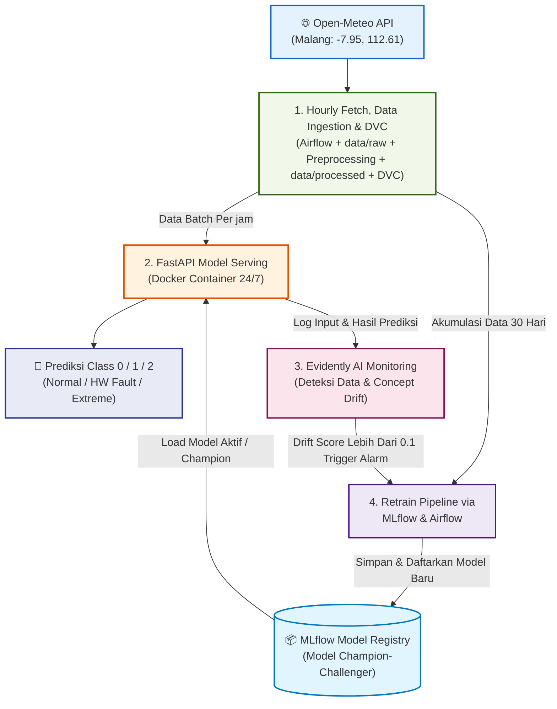
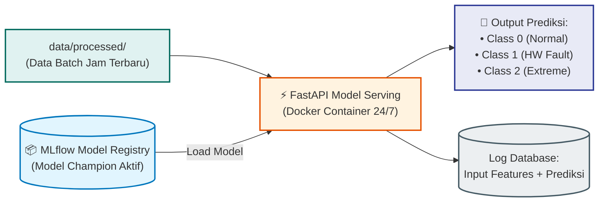
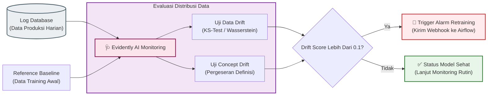
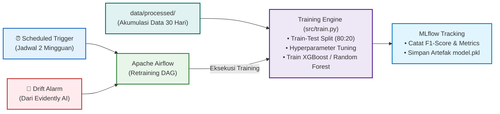
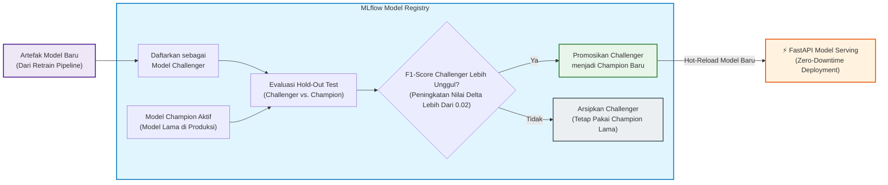
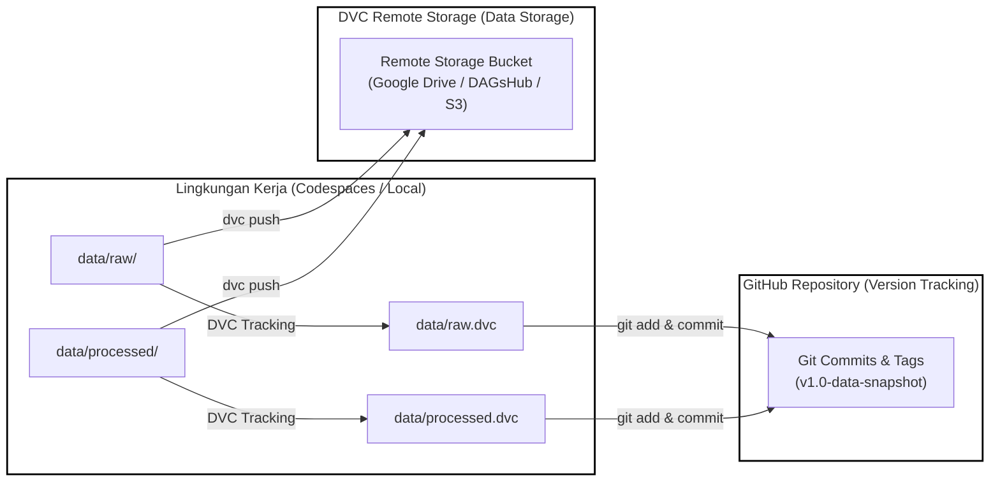

# 📋 LEMBAR KERJA-03 (LK-03)
# Perancangan Arsitektur Pipeline Data & Desain ETL MLOps

> **Sistem Otomatis Deteksi Anomali Data Cuaca Open-Meteo untuk Smart Farming Berbasis MLOps**  
> Mata Kuliah: Machine Learning Operations (MLOps) — TIF-B 2026  
> Program Studi Teknik Informatika, Fakultas Ilmu Komputer, Universitas Brawijaya  

| Informasi Akademik | Detail Mahasiswa |
|---|---|
| **Nama Mahasiswa** | Muhammad Ghazy Humaidi |
| **NIM** | 245150200111071 |
| **Dosen Pengampu** | Rizal Setya Perdana, S.Kom., M.Kom., Ph.D. |
| **Repositori GitHub** | [MLOps-AnomaliCuacaOpenMeteo](https://github.com/ghazthiskc19/MLOps-AnomaliCuacaOpenMeteo) |

---

## DAFTAR ISI
1. [BAB 1: Deskripsi Sumber Data](#bab-1-deskripsi-sumber-data)
   - 1.1 Identifikasi dan Profil Sumber Data
   - 1.2 Rasionalisasi Pemilihan Sumber Data
   - 1.3 Karakteristik Data Dinamis dan Mekanisme Pengambilan Berkala
   - 1.4 Relevansi dengan Continual Learning dan Antisipasi Pergeseran Data (*Data Drift*)
2. [BAB 2: Skema Data Awal (Raw Data Schema)](#bab-2-skema-data-awal-raw-data-schema)
   - 2.1 Struktur dan Representasi Data Mentah
   - 2.2 Kamus Data Awal (*Data Dictionary*)
   - 2.3 Mekanisme Baseline Profiling dan Taksonomi Kegagalan Sensor
   - 2.4 Kebijakan Format Penyimpanan dan Partisi Landing Zone
3. [BAB 3: Diagram Arsitektur Pipeline Data](#bab-3-diagram-arsitektur-pipeline-data)
   - 3.1 Gambaran Umum dan Evolusi Arsitektur
   - 3.2 Visualisasi Diagram Arsitektur Pipeline Data
   - 3.3 Dekomposisi Komponen & Logika Alur Kerja ETL
   - 3.4 Mekanisme Versioning Data Menggunakan DVC
   - 3.5 Pemetaan Komponen Pipeline ke Lingkungan Repositori & Codespaces
4. [BAB 4: Bukti Pengambilan Data (Proof of Data Capture)](#bab-4-bukti-pengambilan-data-proof-of-data-capture) *(Tahap Selanjutnya)*

---

# BAB 1: DESKRIPSI SUMBER DATA

### 1.1 Identifikasi dan Profil Sumber Data
Dalam perancangan sistem MLOps deteksi anomali cuaca untuk *Smart Farming*, proyek ini menetapkan **Open-Meteo API** sebagai sumber data primer tunggal (*single primary data source*). Open-Meteo merupakan platform penyedia layanan data meteorologi dan agrikultur global berbasis *open-source* yang mengintegrasikan model prediksi numerik beresolusi tinggi dari berbagai badan cuaca dunia (seperti ECMWF, NOAA, DWD, dan JMA).

Sistem menargetkan pemantauan mikroklimat pada lahan pertanian spesifik di wilayah **Kota Malang, Jawa Timur**, dengan parameter geospasial sebagai berikut:

| Parameter Konfigurasi | Nilai / Spesifikasi Teknis | Keterangan Operasional |
|---|---|---|
| **Penyedia Layanan** | Open-Meteo Weather API | Layanan publik tanpa autentikasi token berbayar |
| **Endpoint URL** | `https://api.open-meteo.com/v1/forecast` | API RESTful berbasis HTTP GET |
| **Target Wilayah** | Malang, Jawa Timur, Indonesia | Representasi lahan pertanian hortikultura/sub-urban |
| **Koordinat Latitude** | `-7.95` | Derajat lintang selatan |
| **Koordinat Longitude** | `112.61` | Derajat bujur timur |
| **Zona Waktu (Timezone)** | `Asia/Jakarta` (WIB / UTC+7) | Penyelarasan kronologis waktu lokal |
| **Protokol Komunikasi** | HTTPS / TLS Terenkripsi | Standar transfer data web aman |
| **Format Serialisasi** | JSON (*JavaScript Object Notation*) | Payload hierarki berstruktur seragam |

Data yang diperoleh mencakup parameter agrometeorologi utama yang berpengaruh langsung pada fisiologi tanaman, kelembaban media tanam, dan risiko anomali fisik sensor di lapangan. Variabel inti yang ditarik meliputi:
1. **Suhu Udara (`temperature_2m`)**: Mengukur temperatur ambien 2 meter di atas permukaan tanah dalam derajat Celcius (°C).
2. **Kelembaban Relatif (`relative_humidity_2m`)**: Mengukur kejenuhan uap air di udara dalam persentase (%).
3. **Presipitasi / Curah Hujan (`precipitation`)**: Akumulasi air hujan per jam dalam milimeter (mm).
4. **Kelembaban Tanah (`soil_moisture_0_to_7cm`)**: Rasio volume air terhadap tanah pada kedalaman perakaran dangkal ($m^3/m^3$).
5. **Radiasi Gelombang Pendek (`shortwave_radiation`)**: Intensitas energi matahari langsung dan bauran ($W/m^2$).
6. **Kecepatan Angin (`wind_speed_10m`)**: Laju aliran udara pada ketinggian 10 meter (km/h).

### 1.2 Rasionalisasi Pemilihan Sumber Data
Pemilihan Open-Meteo API didasari oleh pertimbangan teknis, reliabilitas operasional, serta kelayakan implementasi MLOps jangka panjang:

1. **Aksesibilitas Terbuka dan Bebas Hambatan Autentikasi (*Zero-Credential Friction*)**  
   Open-Meteo API tidak mewajibkan penggunaan *API Key* komersial atau mekanisme token berbatas waktu untuk penggunaan non-komersial hingga batasan wajar (10.000 panggilan per hari). Karakteristik ini meminimalkan risiko kegagalan pipeline akibat insiden *expired token* atau kebocoran kredensial dalam repositori publik, serta memastikan pipeline CI/CD di GitHub Codespaces dapat berjalan secara deterministik tanpa *secret configuration overhead*.
2. **Standardisasi Metrik Meteorologi & Agrikultur**  
   Parameter yang disediakan telah melalui kalibrasi standar *World Meteorological Organization* (WMO). Tersedianya variabel agrikultur spesifik seperti *soil moisture* pada kedalaman 0–7 cm menjadi faktor kunci yang jarang disediakan oleh API cuaca publik biasa, memungkinkan simulasi kondisi sensor agrikultur riil di lapangan.
3. **Deterministik dan Tingkat Ketersediaan (*High Availability*) Tinggi**  
   Infrastruktur Open-Meteo didistribusikan melalui jaringan CDN global dengan tingkat ketersediaan (*uptime*) melampaui 99.9%. Skema respons JSON yang konsisten menjamin pipeline *data ingestion* dapat melakukan *parsing* secara andal tanpa risiko perubahan skema payload secara tiba-tiba (*API schema drift*).

### 1.3 Karakteristik Data Dinamis dan Mekanisme Pengambilan Berkala
Sistem ini beroperasi di atas paradigma **data dinamis** (*streaming micro-batch*), bukan dataset statis *one-time download*. Data cuaca di alam bersifat kontinyu dan terus bergerak seiring waktu, yang dicirikan oleh dua dimensi dinamika:
- **Variabilitas Temporal Siklus Harian (*Diurnal Cycle*)**: Suhu, kelembaban udara, dan radiasi matahari berfluktuasi secara dinamis antara siang dan malam hari.
- **Variabilitas Musiman (*Seasonal Variability*)**: Transisi makroklimat antara musim hujan dan musim kemarau di wilayah Malang secara berkala mengubah distribusi baseline metrik lingkungan.

Untuk menangkap dinamika tersebut secara efisien tanpa menimbulkan *computational bottleneck* atau pemborosan penyimpanan, sistem menerapkan strategi penarikan data:

1. **Frekuensi Penarikan: *Periodic Micro-Batch* (Per 1 Jam)**  
   Data ditarik secara teratur setiap interval satu jam (`@hourly`). Frekuensi ini dipilih secara optimal karena dinamika cuaca alamiah dan kelembaban tanah tidak mengalami perubahan drastis dalam skala detik, sehingga penarikan per jam memberikan resolusi temporal yang cukup presisi untuk mendeteksi anomali tanpa membebani kuota komputasi dan bandwidth jaringan.
2. **Kombinasi Data Historis dan Data Prakiraan (*Nowcast Window*)**  
   Setiap siklus penarikan memanfaatkan parameter `past_days` dan `forecast_days`. Hal ini memungkinkan sistem untuk memvalidasi pembacaan jam sebelumnya secara retrospektif sekaligus mengonsumsi proyeksi *nowcast* untuk mempersiapkan komputasi fitur lag (*lagged features*) dan *rolling window statistics*.
3. **Mekanisme Ketahanan Jaringan (*Fault-Tolerant Ingestion*)**  
   Proses *ingestion* dilengkapi mekanisme *retry* dengan pola *exponential backoff*. Jika konektivitas ke Open-Meteo API mengalami *timeout* sementara, modul *ingestion* akan mengulang percobaan penarikan secara adaptif (misal jeda 2s, 4s, 8s) sebelum melempar sinyal kegagalan, sehingga integritas deret waktu (*time-series continuity*) tetap terjaga.

### 1.4 Relevansi dengan Continual Learning dan Antisipasi Pergeseran Data (*Data Drift*)
Mekanisme aliran data dinamis berkala ini merupakan prasyarat fundamental dalam siklus hidup MLOps, khususnya untuk mendukung strategi *Continual Learning* (CL) dan *Continuous Training* (CT) yang dirumuskan pada LK-01:

1. **Antisipasi *Data Drift* (*Covariate Shift*)**  
   Pada masa pergantian musim (kemarau ke hujan di Malang), batas distribusi suhu harian dapat bergeser dari rentang 32°C–36°C menjadi 20°C–26°C, disertai kenaikan drastis intensitas presipitasi. Model statis yang dilatih hanya pada satu musim akan mengalami penurunan *confidence score* saat menghadapi distribusi baru. Aliran data dinamis yang terus tersimpan ke repositori memungkinkan sistem monitoring (Evidently AI) melakukan uji statistik (*Wasserstein Distance* atau *KS-Test*) secara berkala untuk mendeteksi *drift*.
2. **Antisipasi *Concept Drift***  
   Kondisi cuaca tertentu memiliki interpretasi anomali yang berbeda tergantung konteks musim. Contoh: Suhu 35°C pada puncak musim hujan di Malang tergolong fenomena langka yang diklasifikasikan sebagai **Class 2 (Extreme Environmental Anomaly)**, namun angka yang sama di siang hari terik musim kemarau adalah **Class 0 (Normal State)**. Ingestion berkala menyediakan data mutakhir yang berkesinambungan sebagai bahan baku untuk proses *re-labeling* dan *retraining* otomatis agar model tidak menghasilkan lonjakan *False Positive*.
3. **Penyediaan *Sliding Window Training Buffer***  
   Dengan aliran data dinamis yang disimpan ke direktori `data/raw/` dan ditransformasikan ke `data/processed/`, sistem MLOps selalu memiliki cadangan data 30 hari terakhir (*rolling 30-day window*) yang siap digunakan kapan pun *retraining trigger* aktif (baik pemicu terjadwal 2 mingguan maupun *drift alarm* darurat).

---

# BAB 2: SKEMA DATA AWAL (RAW DATA SCHEMA)

### 2.1 Struktur dan Representasi Data Mentah
Data cuaca yang ditarik dari Open-Meteo API awalnya tiba dalam bentuk berkas berorientasi hierarki objek (*nested JSON*). Payload respons terdiri dari dua komponen utama:
1. **Metadata Blok**: Berisi koordinat geografis aktual hasil interpolasi grid (`latitude`, `longitude`), elevasi ketinggian, zona waktu (`timezone`), serta latensi generasi model cuaca.
2. **Time-Series Block (`hourly`)**: Berisi array paralel berpasangan di mana elemen ke-$i$ pada array `time` merepresentasikan waktu observasi untuk metrik ke-$i$ pada seluruh array variabel lainnya.

Modul penarikan data mentransformasikan (*flattening*) struktur hierarki JSON tersebut menjadi bentuk matriks tabular dua dimensi (Pandas DataFrame) tanpa melakukan modifikasi atau rekayasa nilai, lalu menyimpannya ke dalam zona pendaratan data mentah (*raw data landing zone*) di direktori `data/raw/`.

```json
/* Contoh Representasi Struktur JSON Mentah dari Open-Meteo API */
{
  "latitude": -7.95,
  "longitude": 112.61,
  "timezone": "Asia/Jakarta",
  "hourly": {
    "time": ["2026-09-19T00:00", "2026-09-19T01:00", "..."],
    "temperature_2m": [22.4, 21.8, "..."],
    "relative_humidity_2m": [88, 91, "..."],
    "precipitation": [0.0, 0.2, "..."],
    "soil_moisture_0_to_7cm": [0.31, 0.30, "..."],
    "shortwave_radiation": [0.0, 0.0, "..."],
    "wind_speed_10m": [4.2, 3.8, "..."]
  }
}
```

### 2.2 Kamus Data Awal (*Data Dictionary*)
Tabel di bawah ini mendefinisikan kamus data awal (*Data Contract*) untuk setiap fitur yang berada di dalam berkas mentah sebelum memasuki tahapan *cleaning* dan *feature engineering*:

| Nama Atribut (Column Name) | Tipe Data Asal (JSON) | Tipe Data Pandas | Satuan Ukur | Status Nullable | Deskripsi Fungsional & Domain Agrikultur |
|---|---|---|---|---|---|
| **`timestamp`** | `String (ISO 8601)` | `datetime64[ns]` | YYYY-MM-DD HH:MM | Non-Nullable | Waktu pencatatan observasi meteorologi per jam (WIB). Berfungsi sebagai indeks kronologis temporal. |
| **`temperature_2m_C`** | `Float` | `float64` | Derajat Celcius (°C) | Nullable* | Suhu udara ambien pada ketinggian 2 meter di atas permukaan tanah. Penentu laju transpirasi tanaman. |
| **`humidity_percent`** | `Integer / Float` | `float64` | Persen (%) | Nullable* | Kelembaban relatif udara. Menentukan kelembaban lingkungan sekitar kanopi daun tanaman. |
| **`precipitation_mm`** | `Float` | `float64` | Milimeter (mm) | Nullable* | Akumulasi curah hujan cair dalam interval 1 jam terakhir. Input utama pemenuhan air alami lahan. |
| **`soil_moisture`** | `Float` | `float64` | Fraksi volumetrik ($m^3/m^3$) | Nullable* | Kandungan air tanah lapisan atas (0–7 cm). Parameter primer pengendali aktuator irigasi pintar. |
| **`radiation_wm2`** | `Float` | `float64` | Watt per $m^2$ ($W/m^2$) | Nullable* | Radiasi matahari global gelombang pendek. Penentu tingkat fotosintesis dan evaporasi tanah. |
| **`wind_speed_kmh`** | `Float` | `float64` | Kilometer / jam (km/h) | Nullable* | Kecepatan laju angin pada elevasi standar 10 meter. Memengaruhi laju kekeringan permukaan tanah. |

*\*Catatan Kebijakan Nullable: Secara operasional API, nilai kosong (`null/NaN`) tidak boleh terjadi pada kondisi normal. Namun, pada level ingestion, kolom ini disetujui untuk menerima nilai `NaN` semata-mata agar kegagalan transmisi sensor dapat dicatat dan diteruskan ke modul klasifikasi anomali hardware.*

### 2.3 Mekanisme Baseline Profiling dan Taksonomi Kegagalan Sensor

Penetapan batas wajar (*normalcy boundary*) dan diferensiasi anomali tidak menggunakan nilai ambang batas statis (*arbitrary hardcoded thresholds*), melainkan melalui kombinasi **Baseline Statistical Profiling** dan **Taksonomi Kegagalan Fisik Sensor**.

#### A. Fase Pemindaian Baseline Historis (*Historical Baseline Scanning*)
Sebelum menentukan apakah suatu kondisi cuaca tergolong normal atau ekstrem, pipeline ETL menjalankan proses *profiling* terhadap jendela geser data historis (*30-day sliding window*) untuk wilayah Malang. Parameter statistik yang diekstraksi meliputi:
- **Ukuran Pemusatan & Sebaran**: Rata-rata ($\mu$), Standar Deviasi ($\sigma$), Median, dan *Interquartile Range* (IQR).
- **Distribusi Ekstrem**: Persentil ke-1 ($P_1$), Persentil ke-5 ($P_5$), Persentil ke-95 ($P_{95}$), dan Persentil ke-99 ($P_{99}$).

Dengan pendekatan ini, definisi **Class 2 (Extreme Environmental Anomaly)** bersifat adaptif terhadap musim:
- Suhu di atas $33^\circ\text{C}$ pada musim hujan akan terdeteksi sebagai anomali ekstrem karena menembus batas $P_{99}$ dari baseline musim hujan ($\mu \approx 24^\circ\text{C}$).
- Sebaliknya, pada puncak musim kemarau, baseline bergeser secara dinamis sehingga suhu $33^\circ\text{C}$ tetap berada dalam batas wajar ($< P_{95}$) dan tidak memicu alarm palsu (*false positive*).

#### B. Taksonomi Identifikasi Kegagalan Perangkat Keras (Class 1: Hardware Fault)
Kegagalan perangkat keras (*node sensor*) di lapangan tidak hanya ditandai oleh nilai di luar batas instrumen, melainkan mencakup 5 modus kegagalan sinyal:

| Modus Kegagalan Hardware | Indikator Matematis & Logika Deteksi | Fenomena Fisik di Lapangan |
|---|---|---|
| **1. Out-of-Bounds (OOB)** | $\text{Nilai} < \text{Min}_{\text{alat}}$ atau $\text{Nilai} > \text{Max}_{\text{alat}}$<br>(Misal: Suhu $< -20^\circ\text{C}$ / $> 55^\circ\text{C}$, Kelembapan $< 0\%$ / $> 100\%$) | Kerusakan komponen internal sensor, *short-circuit* tegangan VCC, atau kerusakan ADC (*Analog-to-Digital Converter*). |
| **2. Stuck Value (Zero Variance)** | $\sigma_{(t-12\text{ jam} \dots t)} = 0$ atau $\Delta x_t = 0$ konstan selama $> 12$ jam berturut-turut pada variabel termal. | Sensor mengalami *freeze*, register mikrokontroler macet (*hang*), atau probe sensor terbungkus kotoran/lumpur padat. |
| **3. Gradient Spiking (Transient Jump)** | $|\Delta x_t| = |x_t - x_{t-1}| > \text{Thresh}_{\text{gradient}}$<br>(Misal: $|\Delta T| > 8^\circ\text{C}/\text{jam}$ tanpa presipitasi) | Gangguan interferensi elektromagnetik (EMI), tegangan listrik berfluktuasi (*floating voltage*), atau sambungan kabel kendor. |
| **4. Null / Packet Loss** | $x_t \text{ is NULL / NaN}$ | Baterai node sensor habis (*brownout*), putus jalur data, atau gangguan konektivitas jaringan transmisi (LoRa/Wi-Fi). |
| **5. Cross-Feature Discordance** | Hubungan kausalitas antar sensor bertentangan.<br>(Misal: $\Delta \text{SoilMoisture} > +30\%$ saat $\text{Rain} = 0\text{ mm}$ dan $\text{Radiation} > 800\text{ W/m}^2$) | Kebocoran elektroda sensor tanah, perendaman sensor oleh genangan lokal yang tidak wajar, atau kabel sinyal terkelupas. |

### 2.3 Matriks Batasan Nilai dan Rasionalisasi Multikelas

Untuk memastikan diferensiasi anomali berjalan secara objektif dan deterministik, batasan data diklasifikasikan ke dalam tiga dimensi terpisah:
1. **Baseline Normal (Class 0)**: Ditetapkan berdasarkan spesifikasi operasional Open-Meteo API dan profil klimatologi wilayah Kota Malang.
2. **Anomali Perangkat Keras / Sensor (Class 1)**: Ditetapkan berdasarkan modus kegagalan fisik instrumen IoT, sirkuit elektrik, dan integritas sinyal transmisi.
3. **Anomali Lingkungan Ekstrem (Class 2)**: Ditetapkan berdasarkan deviasi ekstrem statistik iklim dan dampaknya terhadap ambang toleransi fisiologis tanaman (*Smart Farming*).

#### A. Tabel 1: Batasan Baseline Normal (Class 0 - Kondisi Normal Operasional API)

Tabel ini merangkum rentang operasional normal yang dihasilkan oleh Open-Meteo API (berbasis model numerik ECMWF/ICON) yang disesuaikan dengan kondisi geografis dataran Kota Malang (elevasi ~450–500 mdpl):

| Parameter | Rentang Baseline Normal | Rasionalisasi Berdasarkan API & Karakteristik Wilayah |
|---|---|---|
| **`temperature_2m_C`** | $18.0^\circ\text{C} - 32.0^\circ\text{C}$ | Berdasarkan reanalisis Open-Meteo untuk iklim tropis dataran tinggi Malang. Suhu terendah terjadi saat fajar ($18.0^\circ\text{C}$) dan puncak insolasi siang hari berkisar $30.0^\circ\text{C} - 32.0^\circ\text{C}$. Fluktuasi ini mencerminkan siklus diurnal wajar tanpa adanya anomali termal. |
| **`humidity_percent`** | $55.0\% - 95.0\%$ | Wilayah Malang memiliki kelembaban relatif tinggi khas tropis basah. Model Open-Meteo merefleksikan nilai terendah sekitar $55\%$ pada siang hari cerah terik dan mencapai kondisi mendekati jenuh ($90\% - 95\%$) pada dini hari berkabut atau pasca-hujan. |
| **`precipitation_mm`** | $0.0 - 15.0\text{ mm/jam}$ | Model presipitasi Open-Meteo bersifat non-negatif. Rentang $0.0\text{ mm}$ (kering) hingga $15.0\text{ mm/jam}$ mencakup karakteristik hujan lokal di Malang (dari gerimis hingga hujan lebat konvektif sedang) yang lazim terjadi dan dapat ditampung sistem drainase lahan. |
| **`soil_moisture`** | $0.18 - 0.40\text{ m}^3/\text{m}^3$ | Mengacu pada model lapisan tanah HTESSEL (0–7 cm) Open-Meteo untuk tanah lempung/vulkanik subur Malang. Rentang ini merepresentasikan kapasitas lapang (*field capacity*) ideal di mana pori-pori tanah memiliki keseimbangan air dan oksigen optimal untuk perakaran tanaman. |
| **`radiation_wm2`** | $0.0 - 950.0\text{ W/m}^2$ | Open-Meteo menghitung radiasi gelombang pendek berdasarkan sudut zenith matahari di khatulistiwa. Radiasi bernilai $0.0\text{ W/m}^2$ saat malam hari (18.00–05.00 WIB) dan mencapai intensitas normal $700 - 950\text{ W/m}^2$ pada siang hari cerah tanpa tutupan awan tebal. |
| **`wind_speed_kmh`** | $2.0 - 25.0\text{ km/h}$ | Terletak di cekungan pegunungan (Arjuno, Panderman, Semeru), pola sirkulasi angin di Malang didominasi angin lembah-gunung berkategori sepoi-sepoi (*light to moderate breeze*, Skala Beaufort 1–4) yang aman bagi struktur fisik tanaman. |

#### B. Tabel 2: Batasan dan Kriteria Anomali Hardware (Class 1 - Kegagalan Sensor/Instrumen)

Tabel ini merasionalkan kegagalan fisik sensor di lapangan, anomali elektrik, serta kegagalan integritas paket data transmisi:

| Parameter | Kondisi / Ambang Batas Anomali Hardware | Rasionalisasi Kegagalan Perangkat Keras / Sensor |
|---|---|---|
| **`temperature_2m_C`** | • $T < -20.0^\circ\text{C}$ atau $T > 55.0^\circ\text{C}$ (*Out-of-Bounds*)<br>• $\sigma_{12\text{jam}} = 0$ / Nilai konstan persis (*Stuck Value*)<br>• $\|\Delta T\| > 8.0^\circ\text{C}/\text{jam}$ tanpa presipitasi (*Spiking*) | • Nilai di luar $-20^\circ\text{C}$ s.d. $55^\circ\text{C}$ menandakan korsleting daya VCC atau putusnya resistansi internal termistor (ADC membaca batas saturasi tegangan *rail-to-rail*).<br>• Nilai konstan tanpa variasi $\pm 0.1^\circ\text{C}$ selama 12 jam mustahil terjadi di alam terbuka; mengindikasikan register mikrokontroler macet (*firmware hang*).<br>• Lonjakan mendadak $>8^\circ\text{C}$ per jam mencerminkan *voltage drop* baterai atau induksi elektromagnetik (EMI) pada jalur kabel sinyal. |
| **`humidity_percent`** | • Nilai $< 0.0\%$ atau $> 100.0\%$ (*Out-of-Bounds*)<br>• Nilai $100.0\%$ jenuh konstan berturut-turut $> 24$ jam di musim panas | • Sensor kapasitif/resistif polimer yang rusak menghasilkan resistansi di luar rentang kalibrasi ADC, menghasilkan nilai matematika mustahil ($<0\%$ atau $>100\%$).<br>• Kelembaban jenuh $100\%$ persisten berhari-hari saat cuaca terik mengindikasikan probe higrometer terendam air genangan atau tersumbat lapisan lumpur/lumut konduktif. |
| **`precipitation_mm`** | • Nilai presipitasi $< 0.0\text{ mm}$<br>• Tercatat curah hujan deras konstan saat radiasi $> 800\text{ W/m}^2$ (*Discordance*) | • Presipitasi negatif adalah anomali *logical bit corruption* pada pembacaan sensor atau kegagalan *buffer parsing* API.<br>• Data hujan lebat di bawah terik matahari tanpa penurunan suhu menandakan saklar *reed switch* pada sensor *tipping-bucket* korslet atau tersangkut kotoran mekanik. |
| **`soil_moisture`** | • Nilai $< 0.00$ atau $> 0.55\text{ m}^3/\text{m}^3$ (*Out-of-Bounds*)<br>• Nilai konstan tidak berubah saat hujan lebat $> 20\text{ mm}$ | • Kelembaban tanah volumetrik di atas $0.55\text{ m}^3/\text{m}^3$ pada tanah mineral melewati titik jenuh total (porositas maksimum tanah); menandakan elektroda kapasitif FDR/TDR rusak akibat korosi.<br>• Tidak adanya respons kenaikan nilai pasca-hujan lebat menandakan probe sensor terlepas dari kontak tanah (*air pocket gap*). |
| **`radiation_wm2`** | • Nilai $> 0.0\text{ W/m}^2$ pada jam malam (20.00 – 04.00 WIB)<br>• Nilai $< 0.0\text{ W/m}^2$ | • Adanya radiasi di tengah malam mengindikasikan kebocoran arus (*dark current drift*) pada fotodioda pyranometer atau paparan lampu sorot buatan.<br>• Radiasi bernilai negatif mencerminkan inversi polaritas penguat operasional (*Op-Amp*) akibat *floating ground*. |
| **`wind_speed_kmh`** | • Nilai $< 0.0\text{ km/h}$<br>• Nilai $0.0\text{ km/h}$ konstan selama $>48$ jam pada area terbuka | • Kecepatan angin negatif merupakan galat matematis instrumen.<br>• Kecepatan $0.0\text{ km/h}$ terus-menerus selama dua hari menandakan poros mekanis anemometer macet akibat debu, aus pada *bearing*, atau baling-baling/mangkuk sensor patah. |
| **Semua Parameter** | Data bernilai `NULL` / `NaN` (*Missing Data*) | Menandakan hilangnya paket transmisi data akibat baterai *node sensor* drop (*brownout*), interferensi sinyal nirkabel (LoRa/Wi-Fi/GSM), atau kegagalan koneksi ke server penampung. |

#### C. Tabel 3: Batasan dan Kriteria Anomali Lingkungan Ekstrem (Class 2 - Cuaca Ekstrem Agrikultur)

Tabel ini merasionalkan kondisi fisik iklim ekstrem aktual yang memicu dampak signifikan terhadap keberlangsungan tanaman dan memerlukan intervensi aktuator cerdas:

| Parameter | Ambang Batas Anomali Ekstrem (Class 2) | Rasionalisasi Dampak Cuaca Ekstrem Terhadap Agrikultur |
|---|---|---|
| **`temperature_2m_C`** | • Suhu Panas Ekstrem: $> 33.5^\circ\text{C}$ (atau $> P_{99}$ baseline)<br>• Suhu Dingin Ekstrem: $< 15.0^\circ\text{C}$ (atau $< P_{1}$ baseline) | • Gelombang panas (*heatwave*) lokal tropis $>33.5^\circ\text{C}$ memicu penutupan stomata daun tanaman, merusak proses fotosintesis, dan meningkatkan evaporasi air tanah drastis sehingga memicu *heat stress*.<br>• Suhu di bawah $15.0^\circ\text{C}$ (intrusi massa udara kutub/muson timur di Malang) berisiko menimbulkan fenomena embun upas (*frost damage*) yang mematikan sel-sel tanaman hortikultura. |
| **`humidity_percent`** | • Udara Kering Ekstrem: $< 40.0\%$ | • Penurunan kelembaban di bawah $40\%$ menciptakan lonjakan *Vapor Pressure Deficit* (VPD) yang ekstrem. Udara yang terlampau kering akan "menyedot" cairan daun lebih cepat daripada kemampuan akar menyerap air, menyebabkan tanaman layu mendadak (*acute transpiration shock*). |
| **`precipitation_mm`** | • Badai Hujan Tropis Ekstrem: $> 25.0\text{ mm/jam}$ | • Mengacu standar BMKG, intensitas $>20 - 25\text{ mm/jam}$ dikategorikan sebagai hujan sangat lebat/badai. Dampak fisiknya mencakup erosi lapisan hara tanah teratas (*topsoil erosion*), genangan air mendadak (*waterlogging*), dan kerusakan tajuk tanaman. |
| **`soil_moisture`** | • Kekeringan Kritis: $< 0.08\text{ m}^3/\text{m}^3$<br>• Kejenuhan Berlebih / Banjir: $> 0.48\text{ m}^3/\text{m}^3$ selama $> 48$ jam | • Kandungan air $<0.08\text{ m}^3/\text{m}^3$ telah menembus *Permanent Wilting Point* (titik layu permanen). Matriks partikel tanah mengikat molekul air terlalu kuat sehingga akar tidak mampu lagi menyerap air, memicu kematian tanaman jika aktuator irigasi tidak diaktifkan.<br>• Kelembaban jenuh $>0.48\text{ m}^3/\text{m}^3$ selama berhari-hari mengindikasikan tanah terendam air, menyebabkan kondisi anoksia/hipoksia (akar kehabisan oksigen) dan pembusukan perakaran. |
| **`radiation_wm2`** | • Radiasi Ekstrem: $> 1100.0\text{ W/m}^2$ | • Intensitas radiasi di atas $1100\text{ W/m}^2$ berkorelasi dengan indeks ultraviolet (UV) ekstrem pada tengah hari khatulistiwa, menyebabkan fenomena terbakar matahari (*sunscald*) pada buah dan klorosis daun muda. |
| **`wind_speed_kmh`** | • Angin Kencang / Badai: $> 40.0\text{ km/h}$ | • Menurut Skala Beaufort, angin $>40\text{ km/h}$ (*Strong Breeze / Near Gale*) mampu mematahkan cabang tanaman, merobohkan tiang penyangga *greenhouse*, mengoyak lembaran mulsa plastik di lahan, dan merusak kesetimbangan aerasi tanaman. |

### 2.4 Kebijakan Format Penyimpanan dan Partisi Landing Zone
Untuk mendukung integrasi infrastruktur repositori yang dibangun pada LK-02 serta mempermudah pelacakan versi data (DVC):
1. **Format File**: Berkas mentah disimpan dalam format `CSV` standar RFC 4180 dengan *delimiter* koma (`,`) dan pengkodean karakter `UTF-8`. Pemilihan CSV pada zona *raw* memudahkan transparansi inspeksi cepat pada Codespaces.
2. **Pemberian Nama (*Naming Convention*)**: Setiap batch data mentah yang ditarik secara periodik disimpan dengan konvensi nama berbasis stempel waktu:
   $$\texttt{data/raw/weather\_raw\_YYYYMMDD\_HHMMSS.csv}$$
   atau diakumulasikan ke dalam satu berkas *sliding window* aktif:
   $$\texttt{data/raw/weather\_raw\_current.csv}$$
3. **Immutability (Data Mentah Tidak Boleh Diubah)**: Berkas di dalam direktori `data/raw/` bersifat *read-only* bagi proses hilir (*downstream*). Setiap operasi pembersihan, filtering, atau rekayasa fitur wajib menghasilkan berkas baru di direktori `data/processed/`, sehingga integritas data orisinal tetap terjaga (*data provenance & auditability*).

---

# BAB 3: DIAGRAM ARSITEKTUR PIPELINE DATA

Perancangan arsitektur data merupakan tulang punggung (*backbone*) dalam rekayasa sistem *Machine Learning Operations* (MLOps). Pada sistem konvensional, kegagalan sistem ditandai dengan berhentinya eksekusi program (*runtime error*), namun pada sistem berbasis data, anomali seringkali terjadi secara senyap (*silent failure*)—di mana model tetap menghasilkan output prediksi meskipun input data telah mengalami degradasi fisik sensor atau pergeseran distribusi iklim (*data & concept drift*). Bab ini menyajikan desain arsitektur pipeline data secara komprehensif, mulai dari penarikan data mentah per jam, pembersihan, rekayasa fitur, pelabelan anomali, inferensi *real-time* berbasis API, pemantauan *drift*, hingga pelatihan ulang otomatis (*continuous training*) yang terintegrasi penuh dalam satu siklus tertutup (*closed-loop system*).

---

### 3.1 Gambaran Umum dan Evolusi Arsitektur Sistem
Pada dokumen perancangan awal (LK-01 Halaman 8), arsitektur MLOps dirumuskan pada tataran makro konseptual. Pada Lembar Kerja 03 (LK-03) ini, arsitektur tersebut berevolusi menjadi cetak biru implementasi teknis yang menghubungkan dua dunia yang berbeda:
1. **Dunia Inferensi Real-Time (Micro-Batch Serving)**: Melayani deteksi anomali cuaca per jam secara cepat (< 100 ms) melalui REST API guna melindungi tanaman dan mencegah aktuator otomatis (pompa irigasi) mengambil tindakan keliru akibat sensor rusak.
2. **Dunia Pelatihan Berkelanjutan (Batch Continuous Training)**: Mengakumulasikan data historis jangka panjang (jendela geser 30 hari) untuk melatih ulang model secara periodik atau ketika terjadi perubahan iklim ekstrem musiman di Kota Malang.

Arsitektur ini menghilangkan kelemahan umum pada pipeline analitik statis dengan menyediakan gerbang mutu data (*data quality gate*), kontrol versi data (*Data Version Control / DVC*), *model registry* tersentralisasi, serta putaran umpan balik otomatis (*closed-loop feedback*) dari modul pemantau kesehatan data.

---

### 3.2 Visualisasi Diagram Arsitektur Pipeline Data

Aliran data end-to-end dari sumber eksternal, pemrosesan fitur, inferensi real-time, hingga pemantauan drift dan pelatihan ulang model diilustrasikan pada gambar arsitektur makro berikut:


*Gambar 3.1: Diagram Alur Arsitektur Pipeline Data MLOps End-to-End (Ingestion, Serving, Monitoring, Retraining, dan Model Registry)*

Sintaks Mermaid di bawah ini merepresentasikan struktur arsitektur makro pada Gambar 3.1 secara proporsional:



#### Alur Eksekusi Sistem Step-by-Step:
1. **Langkah 1 (Penarikan & Pemrosesan Data Awal)**: 
   Apache Airflow mengeksekusi penarikan data dari Open-Meteo API setiap 1 jam sekali (`src/data_ingestion.py`). Data mentah disimpan ke `data/raw/weather_raw_current.csv`. Modul `src/data_preprocessing.py` membersihkan data, melakukan pelabelan awal berbasis aturan (*ground-truth labeling*), merekayasa fitur temporal, dan menyimpannya ke `data/processed/weather_features_v1.0.csv` yang dilacak versinya oleh DVC.
2. **Langkah 2 (Inferensi dan Klasifikasi Real-Time)**:
   Data fitur hasil pemrosesan jam tersebut (`Data Batch Per jam`) diteruskan ke layanan **2. FastAPI Model Serving**. FastAPI memuat model aktif (*Champion*) dari **MLflow Model Registry** untuk melakukan prediksi inferensi seketika, menghasilkan klasifikasi status operasional: **Class 0 (Normal)**, **Class 1 (Hardware Fault)**, atau **Class 2 (Extreme Environmental)**.
3. **Langkah 3 (Pencatatan Log & Pemantauan Drift)**:
   Setiap data fitur input beserta hasil prediksi yang dikeluarkan oleh FastAPI dikirimkan sebagai log ke **3. Evidently AI Monitoring**. Modul ini membandingkan data produksi harian dengan data acuan saat pelatihan untuk menghitung skor *Data Drift* dan *Concept Drift*.
4. **Langkah 4 (Pemicu Pelatihan Ulang Otomatis)**:
   Apabila Evidently AI mendeteksi pergeseran distribusi cuaca yang melampaui ambang batas toleransi (*Drift Score* > 0.1), modul mengirimkan sinyal alarm untuk memicu eksekusi **4. Retrain Pipeline via MLflow & Airflow**. Pipeline retraining ini menyerap data historis **Akumulasi Data 30 Hari** yang telah tersimpan di direktori data.
5. **Langkah 5 (Siklus Tertutup: Registrasi Model & Pembaharuan Serving)**:
   Model baru hasil retraining disimpan ke **MLflow Model Registry** sebagai model penantang (*Challenger*). Setelah melewati evaluasi otomatis dan terbukti lebih unggul dibanding model lama, statusnya dipromosikan menjadi model utama (*Champion*). **FastAPI Model Serving** secara otomatis me-load model Champion baru tersebut, sehingga siklus adaptasi model berlangsung secara mulus tanpa *downtime*.

---

### 3.3 Dekomposisi Komponen & Logika Fungsional Sistem

Berikut adalah dekomposisi modular terperinci untuk setiap komponen arsitektur sistem MLOps:

#### 1. Modul Penarikan, ETL, dan Versioning Data (Tahap 1)

```mermaid
flowchart LR
    API["🌐 Open-Meteo API<br/>(Malang)"] --> FETCH["HTTP Fetcher<br/>(Airflow @hourly)"]
    FETCH --> RETRY{"Retry Logic<br/>(Backoff 3x)"}
    RETRY -->|Sukses| PARSE["JSON to DataFrame"]
    PARSE --> ETL["data/raw/<br/>weather_raw_current.csv"]
    
    subgraph ETL ["Data Preprocessing (src/data_preprocessing.py)"]
        direction LR
        RAW --> QG["Phase 1: Quality Gate<br/>(Deduplikasi & Bounds)"]
        QG --> LBL["Phase 2: Rule-Based Labelling<br/>(Class 0, 1, 2)"]
        LBL --> FE["Phase 3: Feature Engineering<br/>(sin/cos, rolling, VPD)"]
    end
    
    ETL --> PROC["data/processed/<br/>weather_features_v1.0.csv"]
    PROC --> DVC["DVC Versioning<br/>(Pointer .dvc & Remote Sync)"]

    style API fill:#e3f2fd,stroke:#1565c0,stroke-width:2px
    style ETL fill:#f3e5f5,stroke:#7b1fa2,stroke-width:2px
    style PROC fill:#e0f2f1,stroke:#00695c,stroke-width:2px
    style DVC fill:#fbe9e7,stroke:#d84315,stroke-width:2px
```



- **Hourly Fetch vs. Akumulasi Data 30 Hari**: 
  Penarikan data dari Open-Meteo API dilakukan secara *micro-batch* setiap 1 jam sekali untuk memenuhi kebutuhan inferensi cepat di lapangan. Namun, file `weather_raw_current.csv` dan `weather_features_v1.0.csv` dirancang bersifat akumulatif (*rolling buffer* hingga 30 hari / 720 baris). Hal ini sangat krusial karena algoritma Machine Learning (seperti Random Forest atau XGBoost) **tidak dapat belajar dari data 1 baris**, melainkan membutuhkan riwayat tren cuaca minimal 30 hari untuk memahami pola siklus harian dan musiman.
- **Peran Rule-Based Labelling vs. Model Klasifikasi**:
  Data cuaca mentah dari API hanya berupa angka kontinu tanpa label target ($y$). Modul *Rule-Based Labelling* pada tahap preprocessing bertugas membuat label awal (*Ground Truth*) berdasarkan batasan fisik dan baseline statistik yang dirumuskan pada Bab 2. Label inilah yang menjadi bahan acuan supervisi untuk melatih model Machine Learning.
- **Penyimpanan Data Version Control (DVC)**:
  Dataset di `data/raw/` dan `data/processed/` dikunci menggunakan hash MD5 oleh DVC (`.dvc`), sementara berkas pointer teksnya dicatat ke dalam Git. Berkas data biner aktual disinkronisasikan ke remote storage, menjamin *reproducibility* eksperimen tanpa membebani repositori GitHub.

#### 2. FastAPI Model Serving (Tahap 2)



- **Fungsi Utama**: Wadah komputasi inferensi *real-time* yang berjalan mandiri di dalam Docker Container.
- **Mekanisme Kerja**: FastAPI **tidak melakukan pelatihan model**, melainkan memuat model yang **sudah matang** dari Model Registry ke memori container. Ketika data cuaca jam terbaru masuk, FastAPI mengeksekusi `model.predict()` dan mengembalikan respon payload JSON berlatensi rendah (< 100 ms) berisi kelas anomali dan tingkat keyakinan (*confidence score*).

#### 3. Evidently AI Monitoring (Tahap 3)



- **Fungsi Utama**: Evaluasi kesehatan dan stabilitas distribusi data produksi secara berkelanjutan.
- **Pemeriksaan Dua Arah**:
  - *Data Drift (Covariate Shift)*: Menguji pergeseran nilai statistik (menggunakan *Kolmogorov-Smirnov Test* atau *Wasserstein Distance*) pada fitur-fitur penting seperti suhu udara dan kelembaban tanah terhadap baseline saat pelatihan.
  - *Concept Drift*: Mendeteksi apakah relasi pemetaan antara fitur lingkungan dan kelas anomali telah bergeser (misalnya suhu 34°C yang sebelumnya anomali pada musim hujan berubah menjadi normal di musim kemarau).
- **Alarm Webhook**: Jika *drift score* > 0.1, sistem secara otomatis mengirimkan panggilan webhook/API ke Airflow untuk memicu retraining.

#### 4. Retrain Pipeline via MLflow & Airflow (Tahap 4)



- **Fungsi Utama**: Mesin orkestrasi pelatihan ulang model machine learning.
- **Logika Pemicu (Hybrid Trigger)**:
  - Pemicu terjadwal: Berjalan otomatis setiap 2 minggu sekali untuk adaptasi iklim bertahap.
  - Pemicu darurat (*Event-Driven*): Berjalan seketika saat menerima alarm drift dari Evidently AI.
- **Proses Eksekusi**: Mengambil akumulasi dataset 30 hari terakhir dari `data/processed/`, melakukan pemisahan data latih/uji (*train-test split*), melakukan *hyperparameter tuning*, melatih algoritma klasifikasi (XGBoost/Random Forest), serta mencatat metrik evaluasi (F1-score, Confusion Matrix) ke MLflow Tracking.

#### 5. MLflow Model Registry (Penyimpanan Model Champion-Challenger)



- **Fungsi Utama**: Pusat manajemen siklus hidup dan gudang artefak model (*Single Source of Truth for Models*).
- **Mekanisme Champion vs. Challenger**:
  1. Model baru yang dihasilkan oleh Box 4 didaftarkan ke registry dengan status **Model Challenger** (Penantang).
  2. Model penantang diuji performanya pada *hold-out validation set* melawan model yang sedang aktif di produksi (**Model Champion**).
  3. Jika metrik F1-score model Challenger melampaui model Champion (dengan batas peningkatan minimum $\Delta > 0.02$), statusnya dipromosikan menjadi **Champion** (Production).
  4. Sinyal pembaruan dikirim ke FastAPI Model Serving untuk memuat artefak model Champion baru tersebut tanpa menghentikan layanan (*zero-downtime hot-reload*).

---

### 3.4 Mekanisme Versioning Data Menggunakan DVC

Untuk memenuhi prinsip *Reproducibility* pada sistem MLOps dan mencegah pembengkakan ukuran repositori GitHub (*Git Bloat*), pengelolaan versi dataset dipisahkan antara **artefak data** dan **kode pelacak**:



1. **Pemisahan Peran Git dan DVC**:
   - Direktori `data/raw` dan `data/processed` didaftarkan ke dalam berkas `.gitignore` agar berkas CSV berukuran besar tidak diunggah ke repositori GitHub.
   - Perintah `dvc add data/raw data/processed` menghasilkan berkas *pointer* teks berukuran beberapa bita (`data/raw.dvc` dan `data/processed.dvc`) yang berisi hash unik MD5 dari isi direktori data.
   - Berkas pointer `.dvc` ini kemudian di-commit ke Git.
2. **Skema Penomoran Versi Dataset (*Data Version Tagging*)**:
   - Setiap pembaruan data yang menghasilkan *processed dataset* baru dilabeli menggunakan Git Tag dengan format:
     $$\texttt{dataset-v<Mayor>.<Minor>.<Patch>}$$
     *(Contoh: `dataset-v1.0.0` untuk rilis baseline awal, `dataset-v1.1.0` untuk penambahan batch data bulan baru).*
3. **Reproducibility Guarantee**:
   Setiap peneliti atau engineer yang me-clone repositori dapat merekonstruksi dataset secara identik dengan perintah:
   ```bash
   git checkout tags/dataset-v1.0.0
   dvc pull
   ```

---

### 3.5 Pemetaan Komponen Pipeline ke Lingkungan Repositori & Codespaces

Sesuai infrastruktur standar yang disiapkan pada LK-02, seluruh komponen arsitektur di atas terpetakan secara presisi ke dalam struktur direktori proyek:

```text
MLOps-AnomaliCuacaOpenMeteo/
├── .devcontainer/              # Lingkungan eksekusi Codespaces terisolasi (Python 3.11)
├── configs/
│   └── pipeline_config.yaml    # Parameter koordinat Malang, rolling windows, dan threshold anomali
├── data/
│   ├── raw/                    # Pendaratan data mentah Open-Meteo (dikelola DVC)
│   └── processed/              # Dataset hasil cleaning, labelling, & feature engineering (dikelola DVC)
├── src/
│   ├── __init__.py
│   ├── data_ingestion.py       # Skrip penarikan API + fault-tolerant retry logic
│   └── data_preprocessing.py   # Skrip DataCleaner, AnomalyLabeler, & FeatureEngineer
├── dvc.yaml                    # Definisi pipeline DAG DVC (tahap reproducible ETL)
├── .dvc/                       # Konfigurasi remote storage DVC
└── requirements.txt            # Dependensi (requests, pandas, numpy, scikit-learn, dvc)
```


