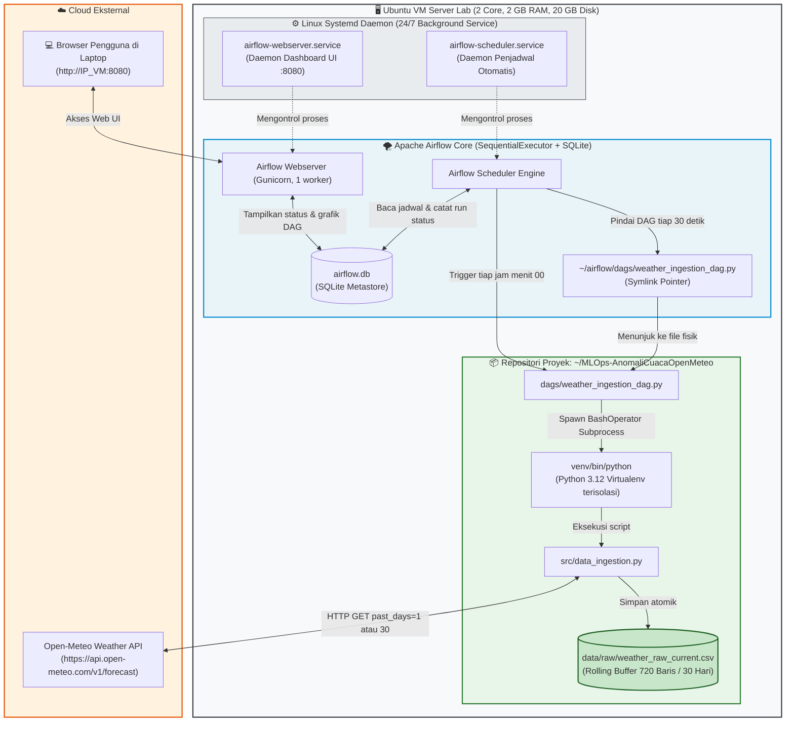
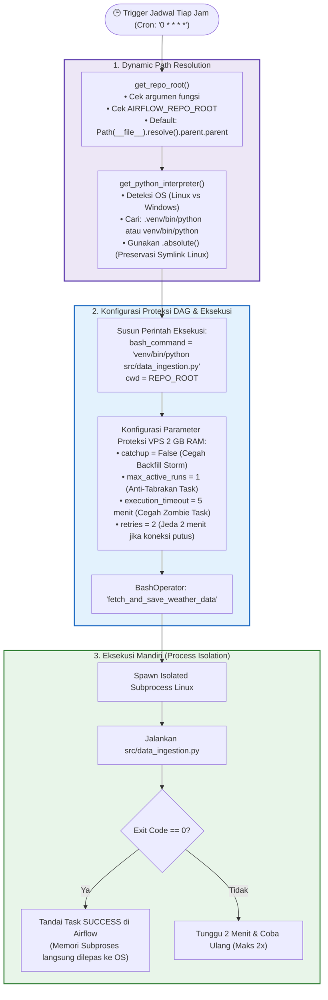
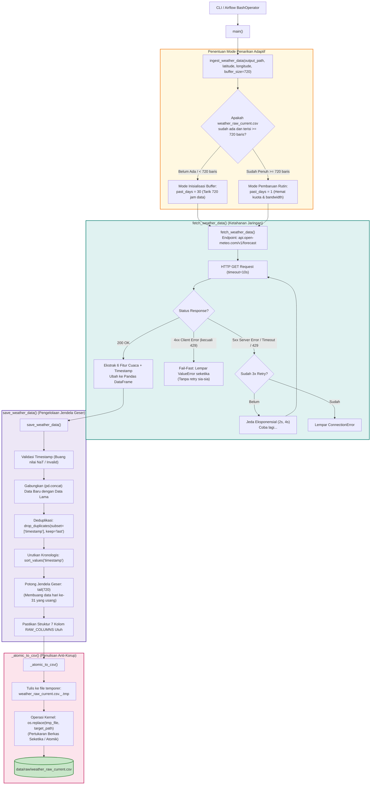
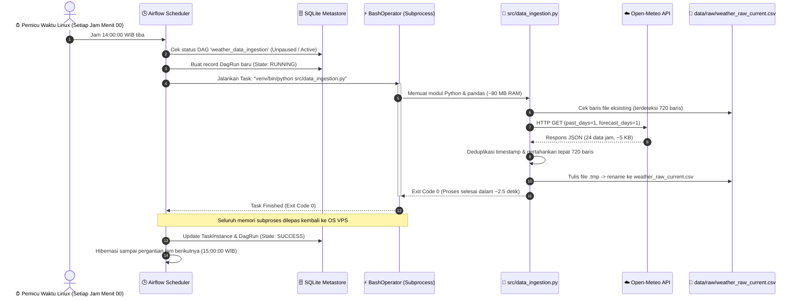

# 📊 Arsitektur & Visualisasi Pipeline Data Ingestion Apache Airflow
> **Proyek**: Sistem Otomatis Deteksi Anomali Data Cuaca Open-Meteo untuk Smart Farming Berbasis MLOps (LK-04)  
> **Lokasi Target**: Kota Malang, Jawa Timur (-7.95, 112.61)  
> **Environment**: Ubuntu Server (2 vCPU, 2 GB RAM, 20 GB Disk + 2 GB Swap)  

---

## 1. Diagram Arsitektur Makro (End-to-End Infrastructure)

Diagram berikut menggambarkan bagaimana sistem operasi Linux di VM lab, daemon Airflow, repositori kode, dan Open-Meteo API saling berinteraksi:

---

## 2. Diagram Detail Alur Logika DAG (`weather_ingestion_dag.py`)

Diagram ini memperlihatkan mekanisme internal pada script DAG penjadwal:

---

## 3. Diagram Detail Fungsi di `src/data_ingestion.py`

Diagram ini memperlihatkan alur logika setiap fungsi pada modul inti penarikan dan pemrosesan data:

---

## 4. Diagram Kronologis Siklus Eksekusi per Jam (Sequence Diagram)

Diagram berikut memperlihatkan lini masa interaksi komponen mulai dari detik ke-0 hingga selesai:

---

## 5. Matriks Peran & Fungsi Komponen

| Komponen / Fungsi | Lokasi Berkas | Peran Utama dalam Sistem |
|---|---|---|
| **`get_repo_root()`** | `dags/weather_ingestion_dag.py` | Menentukan lokasi root proyek secara independen, mencegah salah direktori saat dipanggil Airflow daemon. |
| **`get_python_interpreter()`** | `dags/weather_ingestion_dag.py` | Mendeteksi Python di `venv/bin/python` dengan preservasi symlink Linux agar paket `pandas` dan `requests` terbaca. |
| **`weather_data_ingestion` (DAG)** | `dags/weather_ingestion_dag.py` | Menjadwalkan penarikan data tiap jam (`0 * * * *`) dengan proteksi `catchup=False` dan `max_active_runs=1`. |
| **`fetch_weather_data()`** | `src/data_ingestion.py` | Mengambil payload cuaca dari Open-Meteo dengan proteksi retry eksponensial (3x) dan fail-fast 4xx. |
| **`save_weather_data()`** | `src/data_ingestion.py` | Mengelola rolling window 30 hari (720 baris), deduplikasi timestamp, dan penjagaan skema 7 kolom LK03. |
| **`_atomic_to_csv()`** | `src/data_ingestion.py` | Menulis file via buffer temporer (`.tmp`) dan atomic rename (`os.replace`) agar data tidak pernah korup. |
| **`ingest_weather_data()`** | `src/data_ingestion.py` | Fungsi fasad yang mengorkestrasi penarikan adaptif (30 hari pada inisiasi awal, 1 hari pada pembaruan rutin). |
| **`airflow-scheduler.service`** | `/etc/systemd/system/` | Service systemd Linux yang menjaga scheduler Airflow tetap menyala 24/7 dan auto-restart saat reboot. |
| **`airflow-webserver.service`** | `/etc/systemd/system/` | Service systemd Linux yang melayani Web UI dashboard Airflow di port 8080. |
