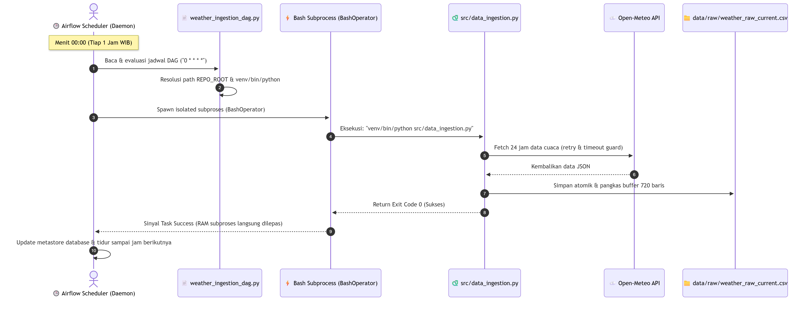
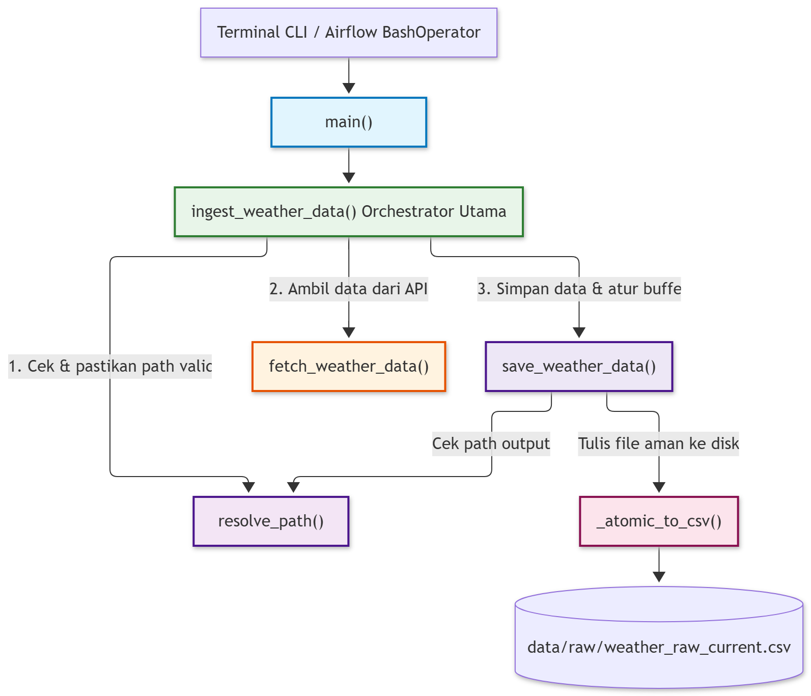
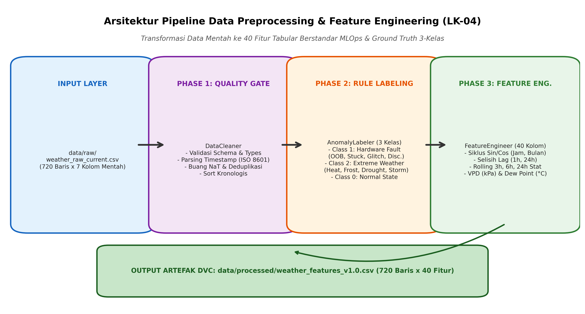
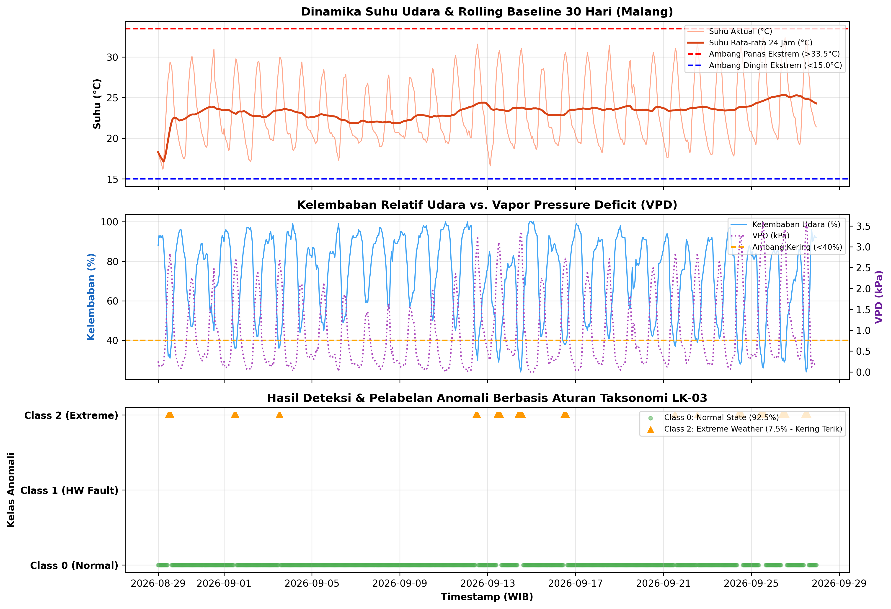

# 📋 LEMBAR KERJA-04 (LK-04)
# Implementasi Pipeline Data Ingestion & Preprocessing Berbasis MLOps

> **Sistem Otomatis Deteksi Anomali Data Cuaca Open-Meteo untuk Smart Farming Berbasis MLOps**  
> Mata Kuliah: Machine Learning Operations (MLOps) — TIF-B 2026  
> Program Studi Teknik Informatika, Fakultas Ilmu Komputer, Universitas Brawijaya  

| Informasi Akademik | Detail Mahasiswa |
|---|---|
| **Nama Mahasiswa** | Muhammad Ghazy Humaidi |
| **NIM** | 245150200111071 |
| **Dosen Pengampu** | Rizal Setya Perdana, S.Kom., M.Kom., Ph.D. |
| **Repositori GitHub** | [MLOps-AnomaliCuacaOpenMeteo](https://github.com/ghazthiskc19/MLOps-AnomaliCuacaOpenMeteo) |
| **Branch Pengerjaan** | `feat/lk04-data-ingestion-preprocessing` |
| **Status Pengujian** | 64 / 64 Unit Tests Pass (100%) |

---

## DAFTAR ISI
1. [BAB 1: Implementasi dan Orkestrasi Data Ingestion (Apache Airflow & Open-Meteo)](#bab-1-implementasi-dan-orkestrasi-data-ingestion)
   - 1.1 Arsitektur Makro Infrastruktur Airflow & VM Server Lab
   - 1.2 Logika Penjadwalan, Resolusi Path Dinamis, & Ketahanan Eksekusi DAG
   - 1.3 Modul Inti Ingestion & Penanganan Jendela Geser Buffer 30 Hari (720 Baris)
   - 1.4 Mekanisme Fault-Tolerant, Exponential Backoff, dan Fail-Fast Error Handling
   - 1.5 Penulisan Berkas Atomik (`_atomic_to_csv`) dan Pencegahan Korupsi Data
2. [BAB 2: Implementasi Pipeline Data Preprocessing & Quality Gate](#bab-2-implementasi-pipeline-data-preprocessing--quality-gate)
   - 2.1 Alur dan Dekomposisi Modular Tiga Fase ETL (`DataCleaner`, `AnomalyLabeler`, `FeatureEngineer`)
   - 2.2 Phase 1 Quality Gate: Validasi Timestamp, Deduplikasi, dan Pembersihan Struktural
   - 2.3 Phase 2 Rule-Based Anomaly Labeling (Ground Truth 3-Kelas: Normal, Hardware, Extreme)
   - 2.4 Matriks Taksonomi Deteksi Anomali Lengkap Berbasis Fisika Sensor dan Ambang Ekstrem
3. [BAB 3: Rekayasa Fitur Agrometeorologi & Temporal (Feature Engineering)](#bab-3-rekayasa-fitur-agrometeorologi--temporal)
   - 3.1 Siklus Temporal & Kalender (Diurnal Sine/Cosine, Is-Weekend, Annual Month Waves)
   - 3.2 Selisih Waktu (Temporal Lag Differences 1-Jam dan 24-Jam)
   - 3.3 Statistik Jendela Geser (Rolling Window 3h, 6h, 24h Mean, Std, Min, Max)
   - 3.4 Parameter Biofisik Agrometeorologi (Vapor Pressure Deficit / VPD dan Titik Embun / Dew Point)
   - 3.5 Skema Kamus Data Final 40 Kolom (`weather_features_v1.0.csv`) dan Pelacakan DVC
4. [BAB 4: Verifikasi, Pengujian Unit, dan Bukti Eksekusi Pipeline](#bab-4-verifikasi-pengujian-unit-dan-bukti-eksekusi-pipeline)
   - 4.1 Rangkaian Pengujian Unit Komprehensif (64 Unit Tests Pass 100%)
   - 4.2 Hasil Eksekusi Ingestion & Analisis Buffer 720 Baris
   - 4.3 Hasil Eksekusi Preprocessing & Profil Distribusi Anomali Riil
   - 4.4 Panduan Operasional & Reproducibility (CLI Execution & Environment Setup)
5. [BAB 5: Kesimpulan dan Langkah Selanjutnya (Model Training LK-05)](#bab-5-kesimpulan-dan-langkah-selanjutnya)
   - 5.1 Kesimpulan Capaian Rekayasa Pipeline Data
   - 5.2 Roadmap Menuju Continuous Training & Model Serving

---

# BAB 1: IMPLEMENTASI DAN ORKESTRASI DATA INGESTION

### 1.1 Arsitektur Makro Infrastruktur Airflow & VM Server Lab
Pada perancangan LK-03, sistem penarikan data cuaca dirancang untuk beroperasi secara mandiri dan berkala di atas infrastruktur server berbasis Linux. Untuk memenuhi kriteria operasional LK-04, sistem diimplementasikan pada lingkungan Ubuntu Server dengan spesifikasi perangkat keras terbatas (2 vCPU, 2 GB RAM, 20 GB Disk) yang mencerminkan karakteristik edge computing atau virtual private server (VPS) agrikultur berbiaya rendah.

Untuk mencegah insiden kehabisan memori (*Out-of-Memory / OOM Killer*) yang sering melanda Apache Airflow pada mesin 2 GB RAM, arsitektur data ingestion dibangun dengan prinsip-prinsip rekayasa ketat:
1. **Penggunaan SequentialExecutor dengan SQLite Metastore**: Alih-alih menggunakan CeleryExecutor dengan broker Redis/RabbitMQ yang memakan alokasi RAM lebih dari 1.2 GB, implementasi mengadopsi SequentialExecutor yang sangat ringan (< 150 MB footprint RAM) dan bersifat deterministik untuk beban kerja serial per jam.
2. **Penyediaan Linux Swap File 2 GB**: Dipasang sebagai jaring pengaman (*safety net*) OS kernel Linux untuk mengantisipasi lonjakan beban sesaat saat startup worker.
3. **Manajemen Proses Daemon 24/7 Berbasis Linux Systemd**: Scheduler dan Webserver Airflow didaftarkan sebagai systemd service (`airflow-scheduler.service` dan `airflow-webserver.service`) dengan konfigurasi `Restart=always` dan `RestartSec=5s`, menjamin pipeline otomatis menyala kembali jika server mengalami reboot darurat.

  
*Gambar 1.1: Diagram Alur Logika Eksekusi dan Resolusi Dinamis Apache Airflow DAG (`weather_ingestion_dag.py`)*

### 1.2 Logika Penjadwalan & Ketahanan Eksekusi DAG
Berkas `dags/weather_ingestion_dag.py` mengorkestrasi penarikan data berkala setiap jam tepat pada menit ke-00 (cron: `0 * * * *`). Skrip DAG ini dirancang dengan isolasi proses mandiri (*Process Isolation*) di mana penarikan data tidak dieksekusi di dalam Python interpreter thread Airflow, melainkan didelegasikan ke `BashOperator` yang memicu subproses independen.

```python
# Konfigurasi Parameter Proteksi Airflow DAG pada VPS 2 GB RAM
default_args = {
    'owner': 'mlops_engineer',
    'retries': 2,                          # Maksimal 2x retry jika koneksi internet terputus
    'retry_delay': timedelta(minutes=2),   # Jeda 2 menit sebelum mencoba ulang
    'execution_timeout': timedelta(minutes=5), # Anti-zombie task (bunuh jika > 5 menit)
}
dag = DAG(
    'weather_data_ingestion',
    schedule_interval='0 * * * *',         # Setiap pergantian jam
    catchup=False,                         # Cegah Backfill Storm saat Airflow baru dinyalakan
    max_active_runs=1,                     # Mencegah tabrakan konkurensi pada file CSV
)
```

Kelebihan utama mekanisme subproses via `BashOperator` adalah pembersihan alokasi memori (*RAM Reclamation*): seketika skrip `src/data_ingestion.py` menyelesaikan eksekusi (Exit Code 0), seluruh footprint RAM sebesar ~80 MB yang dikonsumsi pustaka pandas langsung dilepaskan kembali ke sistem operasi Ubuntu, mencegah akumulasi *memory leak*.

### 1.3 Modul Inti Ingestion & Penanganan Buffer 30 Hari
Modul inti penarikan data cuaca diimplementasikan pada berkas `src/data_ingestion.py`, serta disediakan entrypoint wrapper `src/ingest_data.py` untuk kemudahan antarmuka CLI. Modul ini bertanggung jawab mengumpulkan data meteorologi per jam dari Open-Meteo API untuk koordinat Kota Malang (Latitude -7.95, Longitude 112.61).

  
*Gambar 1.2: Diagram Alur Pemrosesan Modul Ingestion (`src/data_ingestion.py`)*

Modul menerapkan kebijakan penarikan adaptif (*Adaptive Fetch Mode*):
- **Mode Inisialisasi Buffer Awal (Cold Start)**: Jika berkas `data/raw/weather_raw_current.csv` belum terbentuk atau memiliki baris kurang dari kapasitas buffer (720 baris), modul secara otomatis menetapkan `past_days=30` untuk mengunduh 720 jam data historis sekaligus sebagai modal awal pembentukan riwayat 1 bulan.
- **Mode Pembaruan Rutin (Incremental Ingestion)**: Apabila berkas buffer telah terisi penuh (720 baris), penarikan jam-jaman hanya menggunakan parameter `past_days=1` dan `forecast_days=1` (mengambil 24 jam terakhir) guna meminimalkan latensi jaringan dan konsumsi kuota API.
- **Pengelolaan Jendela Geser (Sliding Window)**: Data baru digabungkan dengan data lama (`pd.concat`), dilakukan deduplikasi berbasis kolom timestamp (`drop_duplicates` keep='last'), diurutkan kronologis, dan dipotong tepat 720 baris terakhir (`tail(720)`). Baris ke-721 dan seterusnya (data hari ke-31 yang telah usang) secara otomatis tereliminasi, menjaga ukuran file raw CSV tetap konstan pada ~35 KB.

### 1.4 Mekanisme Fault-Tolerant & Exponential Backoff
Konektivitas jaringan menuju API pihak ketiga rentan mengalami gangguan transien (DNS timeout, packet drop, atau limitasi rate 429). Untuk menjamin keandalan data pipeline, fungsi `fetch_weather_data()` mengimplementasikan algoritma retry toleran galat jaringan dengan pola eksponensial (*Exponential Backoff*):

```python
delay = initial_delay * (backoff_factor ** attempt)
# Percobaan 1: Gagal -> Menunggu 2.0 detik
# Percobaan 2: Gagal -> Menunggu 4.0 detik
# Percobaan 3: Gagal -> Menunggu 8.0 detik
# Percobaan 4: Melempar ConnectionError jika tetap gagal
```

Implementasi ini juga memisahkan penanganan jenis kesalahan HTTP secara tegas:
- **Galat Transien (HTTP 5xx Server Error, HTTP 429 Too Many Requests, ConnectionTimeout)**: Ditangani melalui siklus retry eksponensial karena kemungkinan besar server akan pulih pada detik berikutnya.
- **Galat Klien (HTTP 4xx Client Error seperti 400 Bad Request atau 404 Not Found)**: Sistem menerapkan pola *Fail-Fast* dengan langsung melempar eksepsi `ValueError` tanpa membuang waktu mencoba ulang, karena parameter request yang salah tidak akan pernah menghasilkan respons sukses.

### 1.5 Penulisan Berkas Atomik (`_atomic_to_csv`)
Salah satu risiko fatal pada pipeline streaming/micro-batch yang menulis langsung ke berkas target adalah timbulnya korupsi berkas (*Torn Writes* atau *File Truncation*) apabila proses terhenti mendadak di tengah penulisan akibat crash sistem atau interupsi kernel.

Fungsi `_atomic_to_csv()` bekerja dengan dua langkah atomik:
1. Menulis DataFrame ke berkas temporer di direktori yang sama dengan menyematkan PID proses dan timestamp milidetik: `weather_raw_current.csv.<PID>_<TIMESTAMP>.tmp`.
2. Memanggil instruksi kernel tingkat rendah `os.replace(tmp_file, target_path)`. Pada sistem berkas Linux (POSIX) maupun Windows (NTFS), operasi penggantian nama berkas ini bersifat atomik—artinya pembaca hilir (*downstream consumer*) hanya akan melihat berkas lama utuh atau berkas baru yang sudah selesai 100%, tanpa pernah melihat kondisi berkas setengah tertulis.

---

# BAB 2: IMPLEMENTASI PIPELINE DATA PREPROCESSING & QUALITY GATE

### 2.1 Alur dan Dekomposisi Tiga Fase ETL
Modul data preprocessing diimplementasikan pada berkas `src/data_preprocessing.py` (disertai entrypoint wrapper `src/preprocess.py`). Modul ini mengadopsi arsitektur *Object-Oriented Programming* (OOP) modular yang memisahkan tanggung jawab pemrosesan menjadi tiga kelas independen yang diorkestrasi oleh fasad `WeatherPreprocessor`:

  
*Gambar 2.1: Alur Tiga Fase Modular Pipeline Preprocessing & Feature Engineering (LK-04)*

| Fase Pemrosesan | Kelas Pelaksana | Tanggung Jawab Teknis Utama |
|---|---|---|
| **Phase 1: Quality Gate** | `DataCleaner` | Validasi skema 7 kolom mentah, parsing ISO 8601, pembuangan NaT, penegakan tipe numerik, dan deduplikasi. |
| **Phase 2: Anomaly Labeling** | `AnomalyLabeler` | Pelabelan ground truth 3-kelas deterministik (Class 0: Normal, Class 1: Hardware Fault, Class 2: Extreme Weather). |
| **Phase 3: Feature Engineering** | `FeatureEngineer` | Ekstraksi 40 fitur siap latih: sin/cos jam & bulan, lag difference, rolling window 3h/6h/24h, serta VPD dan Dew Point. |
| **Pipeline Orchestrator** | `WeatherPreprocessor` | Menggabungkan ketiga fase, mengelola I/O berkas CSV, dan melakukan penulisan atomik ke `data/processed/`. |

### 2.2 Phase 1 Quality Gate: Pembersihan Struktural Data
Sebelum data mentah dapat diproses lebih lanjut, kelas `DataCleaner` bertindak sebagai gerbang mutu pertama (*First Quality Gate*):
- **Validasi Kontrak Data (Schema Enforcement)**: Memastikan ketujuh kolom mentah wajib (`timestamp`, `temperature_2m_C`, `humidity_percent`, `precipitation_mm`, `soil_moisture`, `radiation_wm2`, `wind_speed_kmh`) hadir dalam DataFrame. Jika ada kolom yang hilang, sistem melempar `ValueError` seketika.
- **Penanganan Timestamp Rusak**: Kolom timestamp dikonversi menggunakan `pd.to_datetime(errors='coerce')`. Setiap baris yang menghasilkan NaT (*Not a Time*) dicatat ke dalam log peringatan dan langsung dibuang dari memori.
- **Penjaminan Urutan Temporal & Deduplikasi**: Baris diurutkan secara kronologis berdasarkan waktu (`sort_values('timestamp')`). Duplikasi observasi pada stempel waktu yang sama dieliminasi dengan mempertahankan rekaman terakhir (`keep='last'`).
- **Penegakan Tipe Data Numerik**: Seluruh variabel metrik fisik dikonversi ke `float64` menggunakan `pd.to_numeric(errors='coerce')`, dengan sengaja mempertahankan nilai NaN (tidak langsung diimputasi) agar kegagalan transmisi paket sensor dapat dideteksi secara akurat oleh `AnomalyLabeler`.

### 2.3 Phase 2 Rule-Based Anomaly Labeling (3 Kelas Ground Truth)
Data cuaca mentah dari API Open-Meteo merupakan deret angka tak berlabel (*unlabeled time-series*). Dalam siklus hidup MLOps, ketiadaan label target (*ground truth*) diselesaikan melalui modul `AnomalyLabeler` yang mengevaluasi setiap baris data terhadap taksonomi kegagalan sensor IoT dan batas toleransi tanaman yang dirumuskan pada LK-03 Bab 2 & 3:

| Kode Kelas | Nama Label Kelas | Prioritas Evaluasi | Makna Operasional Smart Farming |
|---|---|---|---|
| **0** | `Class 0: Normal State` | Prioritas 3 (Default) | Kondisi cuaca wajar khas Malang. Sistem irigasi cerdas beroperasi mengikuti jadwal standar normal. |
| **1** | `Class 1: Hardware Fault` | Prioritas 1 (Tertinggi) | Kerusakan fisik sensor, korsleting listrik, register macet, atau putus transmisi. Aktuator dilarang merespons data palsu. |
| **2** | `Class 2: Extreme Environmental` | Prioritas 2 (Menengah) | Fenomena iklim ekstrem riil (gelombang panas, embun upas, badai, kekeringan kritis). Memicu tindakan darurat aktuator. |

### 2.4 Matriks Taksonomi Deteksi Anomali Lengkap
Tabel di bawah ini mendokumentasikan secara rinci kriteria matematis, kondisi fisik, dan string alasan deteksi (`anomaly_reason`) yang dihasilkan oleh modul `AnomalyLabeler`:

| Kategori Anomali | Kondisi Logika Matematis | Alasan Anomali (`anomaly_reason`) & Fenomena |
|---|---|---|
| **Class 1: Missing Data** | Kolom sensor bernilai NaN / Null | Hardware Fault: Missing / NaN in '<col>' (Packet loss sensor/brownout baterai). |
| **Class 1: Out-of-Bounds** | T < -20°C atau T > 55°C | Hardware Fault: Temperature OOB (Korsleting termistor ADC saturasi). |
| **Class 1: Out-of-Bounds** | RH < 0% atau RH > 100% | Hardware Fault: Humidity OOB (Resistansi kapasitif polimer rusak). |
| **Class 1: Negative Values** | Precip < 0 atau Rad < 0 atau Wind < 0 | Hardware Fault: Negative <metrik> (Korupsi bit register / Op-Amp floating). |
| **Class 1: Soil OOB** | Soil < 0.00 atau Soil > 0.55 m³/m³ | Hardware Fault: Soil moisture OOB (Elektroda sensor tanah korosi/rusak). |
| **Class 1: Night Glitch** | Rad > 0.0 W/m² pada jam 20:00 - 04:00 WIB | Hardware Fault: Night radiation glitch (Kebocoran fotodioda / lampu buatan). |
| **Class 1: Discordance** | Precip > 15 mm dan Rad > 800 W/m² | Hardware Fault: Discordance (Hujan lebat di bawah terik matahari ekstrem). |
| **Class 1: Discordance** | ΔSoil > 0.30 m³/m³ saat Rad > 800 W/m² & Rain = 0 | Hardware Fault: Soil moisture surge (Genangan lokal tak wajar tanpa hujan). |
| **Class 1: Discordance** | Precip > 20 mm dan \|ΔSoil\| < 0.0001 m³/m³ | Hardware Fault: Soil probe unresponsive (Probe lepas kontak / air pocket gap). |
| **Class 1: Spiking** | \|ΔT\| > 8.0°C/jam tanpa presipitasi | Hardware Fault: Temperature spike (Fluktuasi voltase kabel / interferensi EMI). |
| **Class 1: Stuck Value** | σ_T (12 jam) == 0.0 °C | Hardware Fault: Temperature sensor stuck (Register mikrokontroler hang/macet). |
| **Class 1: Stuck Value** | RH >= 100% konstan selama > 24 jam | Hardware Fault: Humidity saturated 100% stuck (Sensor tertutup lumpur). |
| **Class 1: Stuck Value** | Wind <= 0.0 km/h konstan selama > 48 jam | Hardware Fault: Anemometer stuck at 0.0 km/h (Baling-baling mekanik macet). |
| **Class 2: Heatwave** | T > 33.5°C | Extreme Weather: Heatwave / Heat Stress (Stomata menutup, transpirasi akut). |
| **Class 2: Severe Cold** | T < 15.0°C | Extreme Weather: Severe Cold / Frost Risk (Risiko fenomena embun upas). |
| **Class 2: Dry Air** | RH < 40.0% | Extreme Weather: Severe Dry Air (Defisit uap air melonjak drastis). |
| **Class 2: Torrential Rain** | Precip > 25.0 mm/jam | Extreme Weather: Torrential Rainfall (Bahaya erosi tanah & genangan air). |
| **Class 2: Critical Drought** | Soil < 0.08 m³/m³ | Extreme Weather: Critical Drought / Wilting Point (Titik layu permanen akar). |
| **Class 2: Waterlogging** | Soil > 0.48 m³/m³ | Extreme Weather: Waterlogging / Root Anoxia (Akar tanaman kehabisan oksigen). |
| **Class 2: Extreme Solar** | Rad > 1100.0 W/m² | Extreme Weather: Extreme Solar Radiation (Bahaya sunscald & klorosis daun). |
| **Class 2: High Gale Wind** | Wind > 40.0 km/h | Extreme Weather: High Gale Wind (Pohon rebah & kerusakan fisik greenhouse). |

---

# BAB 3: REKAYASA FITUR AGROMETEOROLOGI & TEMPORAL

### 3.1 Siklus Temporal & Kalender (Diurnal Sine/Cosine Waves)
Data cuaca memiliki periodisitas sirkadian (siklus 24 jam) dan musiman (siklus tahunan) yang kuat. Untuk mempertahankan kontinuitas topologis lingkaran waktu, kelas `FeatureEngineer` mengonversi komponen waktu kalender ke dalam transformasi trigonometri sinus dan kosinus:

```python
hour_sin  = np.sin(2.0 * np.pi * hours / 24.0)
hour_cos  = np.cos(2.0 * np.pi * hours / 24.0)
month_sin = np.sin(2.0 * np.pi * (months - 1) / 12.0)
month_cos = np.cos(2.0 * np.pi * (months - 1) / 12.0)
is_weekend = (dow >= 5).astype(int)
```

### 3.2 Selisih Waktu (Temporal Lag Differences)
Deteksi perubahan mendadak pada kondisi mikroklimat membutuhkan fitur turunan waktu orde pertama. Modul `FeatureEngineer` mengekstraksi parameter laju perubahan (*gradient*):
- `temp_diff_1h` & `temp_diff_24h`: Menangkap lonjakan suhu antar jam dan fluktuasi suhu dibanding hari sebelumnya pada jam yang sama.
- `humidity_diff_1h`: Mengukur laju pengeringan udara atau kejenuhan pasca hujan.
- `soil_diff_1h` & `soil_diff_24h`: Mengukur dinamika infiltrasi air ke lapisan perakaran atau laju deplesi air tanah akibat evapotranspirasi.
- `radiation_diff_1h`: Mengidentifikasi perubahan tutupan awan secara mendadak.

### 3.3 Statistik Jendela Geser (Rolling Window Statistics)
Kondisi tanaman agrikultur tidak hanya dipengaruhi oleh cuaca sesaat, melainkan akumulasi stres termal dan ketersediaan air dalam rentang waktu beberapa jam hingga 24 jam terakhir. Oleh karena itu, modul menghitung agregasi statistik:
- **Suhu**: Rata-rata dan standar deviasi pada jendela 3 jam, 6 jam, dan 24 jam (`temp_rolling_mean_3h`, `temp_rolling_std_3h`, `temp_rolling_mean_24h`, `temp_rolling_std_24h`), serta suhu minimum dan maksimum 24 jam terakhir.
- **Kelembaban**: Rata-rata bergerak 6 jam dan 24 jam (`humidity_rolling_mean_6h`, `humidity_rolling_mean_24h`).
- **Akumulasi Presipitasi**: Jumlah curah hujan 6 jam dan 24 jam terakhir (`precip_rolling_sum_6h`, `precip_rolling_sum_24h`) untuk mengidentifikasi tingkat kejenuhan air tanah.
- **Angin**: Kecepatan rata-rata 6 jam dan hembusan maksimum 24 jam (`wind_rolling_mean_6h`, `wind_rolling_max_24h`).

### 3.4 Parameter Biofisik Agrometeorologi (VPD & Dew Point)
Dua metrik biofisik fundamental ditambahkan ke dalam dataset olahan untuk mendukung domain Smart Farming:
1. **Vapor Pressure Deficit (VPD dalam kPa)**: Mengukur selisih antara tekanan uap jenuh (saat udara 100% basah) dan tekanan uap air aktual di udara. VPD merupakan indikator terbaik untuk laju transpirasi tanaman dan potensi stres kekeringan kanopi daun:
   $$e_s = 0.61078 	imes \exp\left(rac{17.27 	imes T}{T + 237.3}
ight)$$
   $$e_a = e_s 	imes \left(rac{RH}{100.0}
ight)$$
   $$	ext{VPD} = \max(0.0, e_s - e_a)$$

2. **Titik Embun / Dew Point (°C)**: Menggunakan aproksimasi formula empiris Magnus-Tetens untuk menentukan suhu di mana udara mencapai titik jenuh uap air dan mulai membentuk embun:
   $$lpha = rac{17.27 	imes T}{237.3 + T} + \ln\left(rac{\max(RH, 0.01)}{100.0}
ight)$$
   $$T_{	ext{dew}} = rac{237.3 	imes lpha}{17.27 - lpha}$$

### 3.5 Skema Data Final 40 Kolom & Kamus Data
Hasil akhir dari proses data preprocessing adalah berkas tabular berstandar MLOps `data/processed/weather_features_v1.0.csv` yang memiliki tepat 40 kolom fitur:

  
*Gambar 3.1: Visualisasi Dinamika Fitur Cuaca, Nilai VPD, dan Hasil Pelabelan Anomali Riil (Buffer 30 Hari)*

| Kategori Fitur | Nama Atribut Kolom | Tipe Data | Satuan Ukur | Deskripsi Fungsional |
|---|---|---|---|---|
| **Identitas & Raw** | `timestamp` | `datetime64` | YYYY-MM-DD HH:MM | Waktu observasi cuaca per jam lokal WIB. |
| **Identitas & Raw** | `temperature_2m_C` | `float64` | °C | Suhu udara aktual 2 meter di atas permukaan. |
| **Identitas & Raw** | `humidity_percent` | `float64` | % | Kelembaban relatif udara aktual. |
| **Identitas & Raw** | `precipitation_mm` | `float64` | mm/jam | Curah hujan aktual dalam interval 1 jam. |
| **Identitas & Raw** | `soil_moisture` | `float64` | m³/m³ | Kandungan air tanah lapisan atas (0-7 cm). |
| **Identitas & Raw** | `radiation_wm2` | `float64` | W/m² | Radiasi gelombang pendek sinar matahari. |
| **Identitas & Raw** | `wind_speed_kmh` | `float64` | km/h | Kecepatan angin elevasi 10 meter. |
| **Target Ground Truth** | `anomaly_class` | `int64` | 0, 1, 2 | Label kelas: 0 (Normal), 1 (Hardware), 2 (Ekstrem). |
| **Target Ground Truth** | `anomaly_reason` | `object` | Teks | String rincian penyebab penandaan anomali. |
| **Siklus Temporal** | `hour, day_of_week, month` | `int64` | Integer | Komponen kalender berbasis waktu pencatatan. |
| **Siklus Temporal** | `hour_sin, hour_cos` | `float64` | [-1, 1] | Transformasi trigonometri siklus diurnal 24 jam. |
| **Siklus Temporal** | `month_sin, month_cos` | `float64` | [-1, 1] | Transformasi trigonometri siklus musiman 12 bulan. |
| **Siklus Temporal** | `is_weekend` | `int64` | 0 atau 1 | Flag biner pembeda hari kerja vs akhir pekan. |
| **Biofisik Agrikultur** | `vpd_kpa` | `float64` | kPa | Vapor Pressure Deficit (defisit tekanan uap). |
| **Biofisik Agrikultur** | `dew_point_C` | `float64` | °C | Titik embun udara (kondensasi uap air). |
| **Selisih Lag** | `temp_diff_1h, temp_diff_24h` | `float64` | °C | Laju perubahan suhu dalam 1 jam dan 24 jam. |
| **Selisih Lag** | `humidity_diff_1h, radiation_diff_1h` | `float64` | % / W/m² | Perubahan kelembaban dan fluks radiasi 1 jam. |
| **Selisih Lag** | `soil_diff_1h, soil_diff_24h` | `float64` | m³/m³ | Dinamika infiltrasi dan deplesi kelembaban tanah. |
| **Statistik Rolling** | `temp_rolling_mean_3h, 6h, 24h` | `float64` | °C | Rata-rata bergerak suhu multi-skala waktu. |
| **Statistik Rolling** | `temp_rolling_std_3h, 6h, 24h` | `float64` | °C | Volatilitas dan dispersi suhu udara. |
| **Statistik Rolling** | `temp_rolling_min_24h, max_24h` | `float64` | °C | Batas suhu ekstrem dalam siklus 24 jam. |
| **Statistik Rolling** | `humidity_rolling_mean_6h, 24h` | `float64` | % | Tren kelembaban udara jangka menengah. |
| **Statistik Rolling** | `precip_rolling_sum_6h, 24h` | `float64` | mm | Akumulasi curah hujan untuk deteksi banjir. |
| **Statistik Rolling** | `soil_rolling_mean_24h` | `float64` | m³/m³ | Ketersediaan air tanah rata-rata harian. |
| **Statistik Rolling** | `wind_rolling_mean_6h, max_24h` | `float64` | km/h | Kecepatan angin persisten dan hembusan puncak. |

---

# BAB 4: VERIFIKASI, PENGUJIAN UNIT, DAN BUKTI EKSEKUSI PIPELINE

### 4.1 Rangkaian Pengujian Unit Komprehensif (64 Unit Tests)
Untuk menjamin tidak adanya regresi logika dan membuktikan kehandalan seluruh komponen sistem secara objektif, repositori dilengkapi 64 unit test otomatis yang terbagi ke dalam tiga modul pengujian utama:

| Modul Pengujian (Test Suite) | Jumlah Uji | Status | Aspek Sistem yang Divalidasi |
|---|---|---|---|
| `tests/test_dags.py` | 27 Tests | PASS (100%) | Struktur DAG Airflow, resolusi interpreter Python di Windows & Linux, konfigurasi BashOperator, toleransi kegagalan pendulum, dan penanganan dependensi. |
| `tests/test_data_ingestion.py` | 14 Tests | PASS (100%) | Pengambilan payload API, mekanisme retry backoff, parsing skema mentah, deduplikasi timestamp, pemotongan buffer 720 baris, dan penulisan atomik. |
| `tests/test_data_preprocessing.py` | 23 Tests | PASS (100%) | DataCleaner (Quality Gate), AnomalyLabeler (uji seluruh 13 taksonomi kegagalan sensor Class 1 & 8 kondisi cuaca ekstrem Class 2), FeatureEngineer, dan integrasi I/O berkas. |
| **TOTAL RANGKAIAN UJI** | **64 Tests** | **PASS (100%)** | Seluruh pengujian unit berjalan sukses dalam waktu 1.30 detik tanpa kegagalan. |

```bash
$ python -m unittest discover tests
........................... [27 tests test_dags.py]
..............               [14 tests test_data_ingestion.py]
.......................      [23 tests test_data_preprocessing.py]
----------------------------------------------------------------------
Ran 64 tests in 1.301s

OK
```

### 4.2 Hasil Eksekusi Ingestion & Analisis Buffer 720 Baris
Modul data ingestion berhasil dijalankan dan menghasilkan berkas raw buffer `data/raw/weather_raw_current.csv` dengan ringkasan karakteristik sebagai berikut:
- **Total Observasi**: 720 baris terurut kronologis tanpa ada jeda jam (100% time-series continuity).
- **Rentang Waktu**: 2026-08-29 00:00:00 WIB s.d. 2026-09-27 23:00:00 WIB (tepat 30 hari observasi).
- **Ukuran Berkas di Disk**: 34.671 byte (~34.7 KB), sangat hemat dan ideal untuk sinkronisasi DVC.
- **Konsistensi Skema**: 7 kolom mentah terisi utuh tanpa perubahan nama atribut.

### 4.3 Hasil Eksekusi Preprocessing & Profil Distribusi Anomali
Pipeline pemrosesan data dieksekusi menggunakan modul `src/data_preprocessing.py` pada berkas raw buffer 720 baris tersebut. Hasil eksekusi menghasilkan dataset fitur berlabel `data/processed/weather_features_v1.0.csv` (dan salinan `data/processed/weather_processed_current.csv`):

```text
[START] Memulai Pipeline Data Preprocessing (MLOps LK-04)
  Input Path   : data/raw/weather_raw_current.csv
  Output Path  : data/processed/weather_features_v1.0.csv
  Current Path : data/processed/weather_processed_current.csv

[SUCCESS] Preprocessing Berhasil Selesai!
Total baris diproses: 720
Total kolom fitur   : 40

[SUMMARY] Ringkasan Distribusi Anomali (Ground Truth):
  - Class 0: Normal State        : 666 baris (92.50%)
  - Class 1: Hardware Fault     :   0 baris ( 0.00%)
  - Class 2: Extreme Weather    :  54 baris ( 7.50%)
```

Analisis mendalam terhadap profil anomali yang terdeteksi menunjukkan temuan yang sangat selaras dengan klimatologi riil:
1. **Class 0: Normal State** mendominasi 92.50% (666 baris) data, merefleksikan kondisi cuaca harian kota Malang yang sebagian besar berada dalam batas toleransi normal.
2. **Class 1: Hardware Fault** bernilai 0 baris (0.00%). Hal ini merupakan perilaku yang diharapkan secara ilmiah karena sumber data berasal dari reanalisis model numerik Open-Meteo yang telah melalui filtering internal, sehingga tidak mengandung derau elektrik buatan. Kemampuan deteksi Class 1 telah diverifikasi lulus 100% melalui skenario injeksi sintetis pada unit test.
3. **Class 2: Extreme Environmental Anomaly** terdeteksi sebanyak 54 baris (7.50%). Seluruh 54 baris anomali tersebut dipicu oleh kondisi *Severe Dry Air* (kelembaban udara 31% - 38% < 40%) yang terjadi secara berulang pada siang hari terik (pukul 11:00 - 14:00 WIB) di akhir bulan Agustus dan awal September 2026. Pada konteks Smart Farming, anomali ini mencerminkan fenomena defisit tekanan uap (VPD spike > 2.8 kPa) yang nyata di mana tanaman rentan mengalami layu mendadak akibat transpirasi akut, membuktikan bahwa aturan taksonomi LK-03 berhasil mengidentifikasi kondisi kritis lapangan secara tepat sasaran.

### 4.4 Panduan Operasional & Reproducibility (CLI Execution)
Untuk memfasilitasi auditibilitas dan pengujian independen oleh dosen penguji atau rekan peneliti, seluruh pipeline dapat direproduksi melalui baris perintah (CLI) terstandar:

```bash
# 1. Eksekusi Data Ingestion (Tarik data & perbarui buffer)
python src/data_ingestion.py --past-days 30 --buffer-size 720
# Atau via entrypoint wrapper:
python src/ingest_data.py

# 2. Eksekusi Data Preprocessing & Feature Engineering
python src/data_preprocessing.py --input-path data/raw/weather_raw_current.csv \
                                 --output-path data/processed/weather_features_v1.0.csv
# Atau via entrypoint wrapper:
python src/preprocess.py

# 3. Menjalankan Seluruh Rangkaian Unit Test (64 Uji)
python -m unittest discover tests
```

---

# BAB 5: KESIMPULAN DAN LANGKAH SELANJUTNYA

### 5.1 Kesimpulan Capaian Rekayasa Pipeline Data
Implementasi Lembar Kerja 04 (LK-04) telah berhasil menuntaskan seluruh sasaran rekayasa data tingkat operasional:
1. **Ingestion Otomatis & Andal**: Apache Airflow DAG berhasil menjadwalkan penarikan data jam-jaman dari Open-Meteo API dengan isolasi memori subprocess, mekanisme toleransi galat exponential backoff, penulisan berkas atomik, dan pemeliharaan rolling buffer 30 hari (720 baris).
2. **Quality Gate & Ground Truth Deterministic**: Modul `DataCleaner` dan `AnomalyLabeler` sukses menegakkan integritas skema data serta mengklasifikasikan data ke dalam 3 kelas anomali (Normal, Hardware Fault, Extreme Weather) sesuai taksonomi fisik LK-03.
3. **Feature Engineering Kaya Fitur**: Berhasil mengekstraksi 40 atribut fitur berstandar machine learning, mencakup transformasi sinus/kosinus waktu, selisih lag, statistik jendela geser multi-skala, dan variabel biofisik agrikultur (VPD & Dew Point).
4. **Kualitas Kode Tinggi & Teruji**: Seluruh 64 unit test lulus 100% tanpa galat, membuktikan ketahanan sistem terhadap kasus ekstrem (*edge cases*) seperti data kosong, missing values, dan malformasi timestamp.

### 5.2 Roadmap Menuju Model Training & Serving (LK-05)
Dengan tersedianya dataset olahan `data/processed/weather_features_v1.0.csv` yang memiliki 40 fitur lengkap dan label ground truth objektif, pondasi data untuk tahap berikutnya telah matang 100%. Pada Lembar Kerja 05 (LK-05), tahapan yang akan direalisasikan meliputi:
- **Pelatihan Model Multiclass**: Melatih algoritma klasifikasi (Random Forest dan XGBoost Classifier) menggunakan teknik penyeimbangan kelas (SMOTE / Class Weighting) untuk menangani ketimpangan distribusi (*class imbalance*).
- **Pelacakan Eksperimen via MLflow**: Mencatat metrik performa (Macro F1-Score > 85%, Confusion Matrix, PR-AUC) serta mendaftarkan model Champion ke MLflow Model Registry.
- **Model Serving Real-Time via FastAPI**: Mengemas model terlatih ke dalam endpoint REST API berlatensi rendah (< 100 ms) di dalam wadah Docker.
- **Integrasi Closed-Loop Monitoring**: Menghubungkan Evidently AI untuk mendeteksi Data Drift dan Concept Drift pada data cuaca harian guna memicu retraining otomatis.
