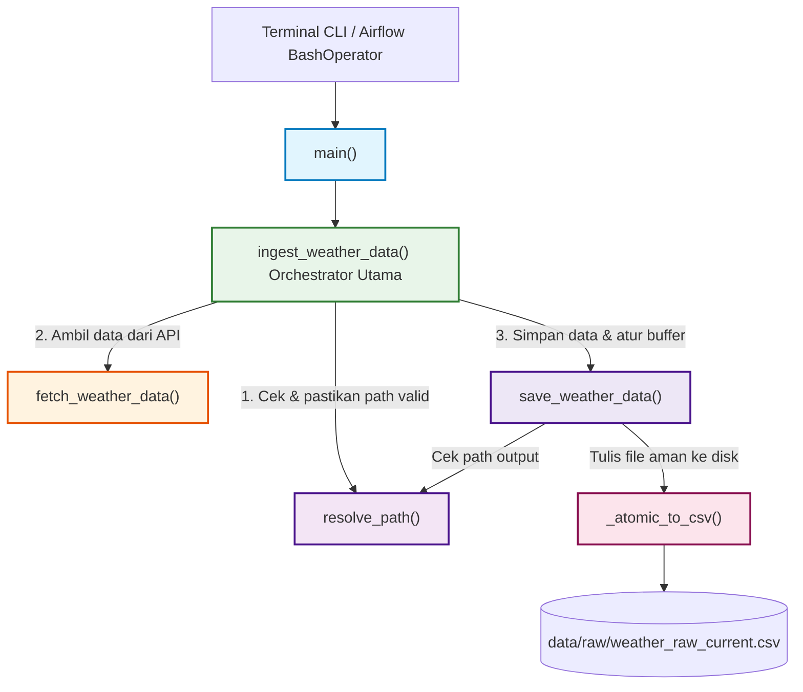
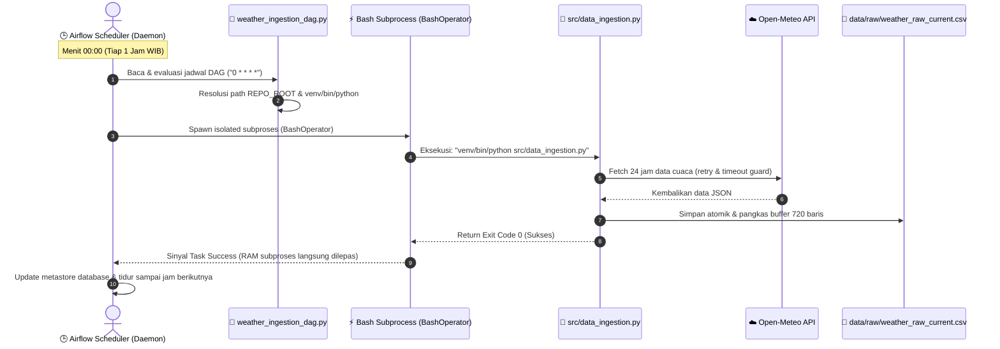
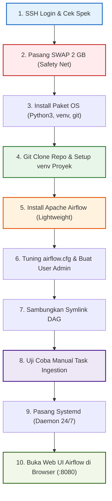

```mermaid
flowchart TD
    CLI[ Terminal CLI / Airflow BashOperator ] --> MAIN["main()"]
    MAIN --> INGEST["ingest_weather_data() Orchestrator Utama"]
    
    INGEST -->|1. Cek & pastikan path valid| RESOLVE["resolve_path()"]
    INGEST -->|2. Ambil data dari API| FETCH["fetch_weather_data()"]
    INGEST -->|3. Simpan data & atur buffer| SAVE["save_weather_data()"]
    
    SAVE -->|Cek path output| RESOLVE
    SAVE -->|Tulis file aman ke disk| ATOMIC["_atomic_to_csv()"]
    ATOMIC --> DISK[( data/raw/weather_raw_current.csv )]

    style MAIN fill:#e1f5fe,stroke:#0277bd,stroke-width:2px
    style INGEST fill:#e8f5e9,stroke:#2e7d32,stroke-width:2px
    style FETCH fill:#fff3e0,stroke:#e65100,stroke-width:2px
    style SAVE fill:#ede7f6,stroke:#4a148c,stroke-width:2px
    style ATOMIC fill:#fce4ec,stroke:#880e4f,stroke-width:2px
    style RESOLVE fill:#f3e5f5,stroke:#4a148c,stroke-width:2px
```

```mermaid
sequenceDiagram
    autonumber
    actor Scheduler as 🕒 Airflow Scheduler (Daemon)
    participant DAG as 📄 weather_ingestion_dag.py
    participant Subprocess as ⚡ Bash Subprocess (BashOperator)
    participant Script as 🐍 src/data_ingestion.py
    participant API as ☁️ Open-Meteo API
    participant Disk as 📁 data/raw/weather_raw_current.csv

    Note over Scheduler: Menit 00:00 (Tiap 1 Jam WIB)
    Scheduler->>DAG: Baca & evaluasi jadwal DAG ("0 * * * *")
    DAG->>DAG: Resolusi path REPO_ROOT & venv/bin/python
    Scheduler->>Subprocess: Spawn isolated subproses (BashOperator)
    Subprocess->>Script: Eksekusi: "venv/bin/python src/data_ingestion.py"
    Script->>API: Fetch 24 jam data cuaca (retry & timeout guard)
    API-->>Script: Kembalikan data JSON
    Script->>Disk: Simpan atomik & pangkas buffer 720 baris
    Script-->>Subprocess: Return Exit Code 0 (Sukses)
    Subprocess-->>Scheduler: Sinyal Task Success (RAM subproses langsung dilepas)
    Scheduler->>Scheduler: Update metastore database & tidur sampai jam berikutnya
```

```mermaid
flowchart TD
    S1["1. SSH Login & Cek Spek"] --> S2["2. Pasang SWAP 2 GB (Safety Net)"]
    S2 --> S3["3. Install Paket OS (Python3, venv, git)"]
    S3 --> S4["4. Git Clone Repo & Setup venv Proyek"]
    S4 --> S5["5. Install Apache Airflow (Lightweight)"]
    S5 --> S6["6. Tuning airflow.cfg & Buat User Admin"]
    S6 --> S7["7. Sambungkan Symlink DAG"]
    S7 --> S8["8. Uji Coba Manual Task Ingestion"]
    S8 --> S9["9. Pasang Systemd (Daemon 24/7)"]
    S9 --> S10["10. Buka Web UI Airflow di Browser (:8080)"]

    style S1 fill:#e3f2fd,stroke:#1565c0,stroke-width:2px
    style S2 fill:#ffebee,stroke:#c62828,stroke-width:2px
    style S4 fill:#e8f5e9,stroke:#2e7d32,stroke-width:2px
    style S5 fill:#fff3e0,stroke:#e65100,stroke-width:2px
    style S8 fill:#ede7f6,stroke:#4a148c,stroke-width:2px
    style S10 fill:#f1f8e9,stroke:#33691e,stroke-width:2px
```